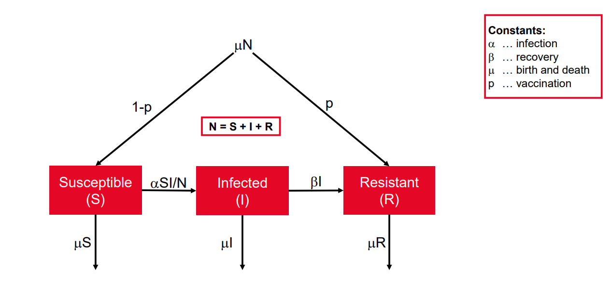
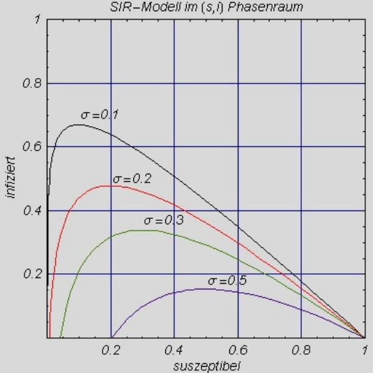
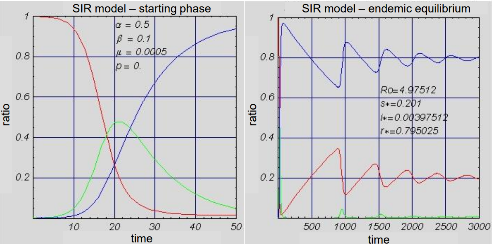
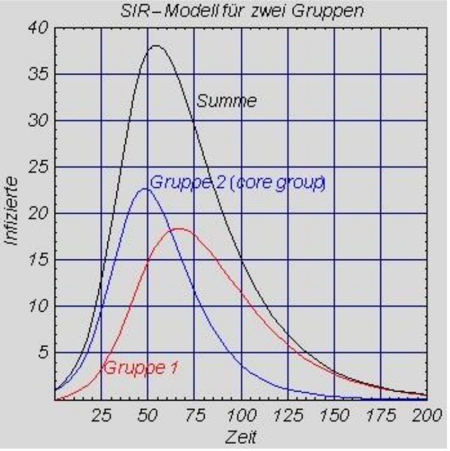
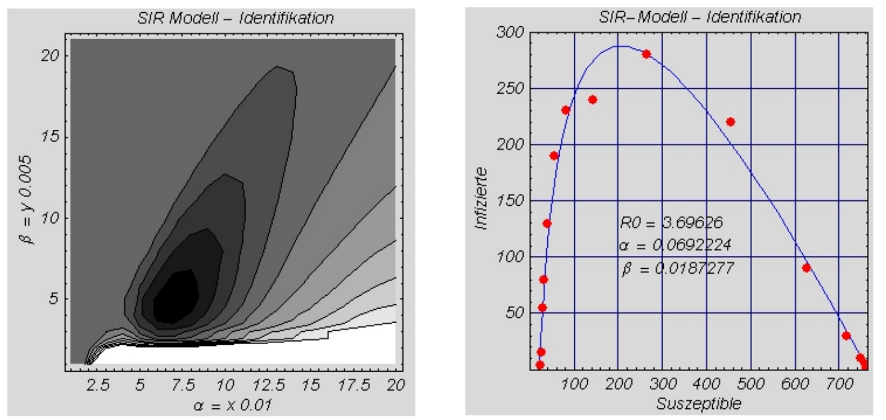

# Epidemien

Hierbei geht es um die Modellierung der Ausbreitung von ansteckenden Krankheiten.
Zentral sind dabei:
- SIR-Modelle: Teilt die Bevölkerung in drei Gruppen:
    - **S**usceptible (Anfällige)
    - **I**nfected (Infizierte)
    - **R**esistant (Immune/Genesene)
- Berechnung von:
    - Infektionsraten
    - Genesungsraten
    - Sterberaten
    - Geburtenraten
- Berücksichtigung verschiedener Bevölkerungsgruppen möglich

## Logistisches Modell
Für die Entwicklung eines Modells zur Ausbreitung von ansteckenden Krankheiten treffen wir zunächst einfache Annahmen, die uns zur bereits bekannten logistischen Gleichung führen.
**Grundannahme:** In einer Population der Größe $N$ beginnt zum Zeitpunkt $t₀ = 0$ der Ausbruch einer ansteckenden Krankheit. Wir untersuchen die Ausbreitung dieser Krankheit unter folgenden Annahmen:
- jedes Mitglied der Population kann infiziert werden
- im untersuchten Zeitraum gibt es keine Heilung von der Krankheit
- jede infizierte Person ist ansteckend, kann sich frei bewegen und Kontakt zu anderen Mitgliedern haben
- in jeder Zeiteinheit hat jede infizierte Person $k$ Kontakte mit anderen Mitgliedern, und jeder Kontakt mit einer gesunden Person führt zur Infektion dieser Person

Aus diesen Annahmen können wir die Anzahl der Kontakte und die Änderungsrate der infizierten Personen $I(t)$ für einen kurzen Zeitraum $Δt$ wie folgt ableiten:
- Anzahl der Kontakte eines Mitglieds mit gesunden Personen: $Q(t) = Δt k (N-I(t))/N$
- Anzahl der Kontakte aller infizierten Personen mit gesunden Personen: $Q(t) I(t)$
- Änderungsrate der infizierten Personen: $dI/dt = k I(t) (N - I(t))/N$
das heißt: $dI/dt = k I(t) - (k/N) I²(t)$

$dI/dt$ ...  Änderungsrate der Infizierten
$N$ ... Gesamtpopulation
$I(t)$ ... Anzahl der Infizierten zum Zeitpunkt t
$k$ ... Kontaktrate

## SIR Modelle

Da die Dynamik der Ausbreitung einer ansteckenden Krankheit von vielen weiteren Faktoren abhängig sein kann, gibt es einen differenzierteren Satz von Modellen: SIR-Modelle, die die Wechselwirkungen berücksichtigen und den Verlauf von anfälligen (Susceptible), infizierten (Infected) und resistenten (Resistant) Personen beschreiben.

Es gelten folgende Annahmen:
- Eine Infektion erfolgt durch den Kontakt eines Gesunden mit einer infizierten Person
- Es werden keine Latenzzeiten berücksichtigt, d.h. eine infizierte Person ist sofort ansteckend
- Eine genesene Person ist dauerhaft immun gegen die Krankheit
- Berücksichtigung von Geburts- und Sterberaten in der Gesamtpopulation
- Jedes neugeborene Kind ist entweder anfällig oder immun (durch Impfung oder Veranlagung)

<br>

Wenn wir den Beginn der Epidemie zum Zeitpunkt $t = 0$ in einer Population mit $N$ Mitgliedern annehmen, dann werden die Zusammenhänge zwischen den drei getrennten Teilmengen der Population ($S$, $I$ und $R$) wie folgt berechnet:
- Anzahl der Anfälligen ($S$) (die nach Kontakt mit Infizierten infiziert werden) zum Zeitpunkt $t$ ... $S(t)$
- Anzahl der Infizierten ($I$) (infizierte Personen können Anfällige infizieren) zum Zeitpunkt $t$ ... $I(t)$
- Anzahl der resistenten Mitglieder ($R$) (sicher vor Infektion) zum Zeitpunkt $t$ ... $R(t)$
- Anfangsbedingungen: $S(0) = S_0$, $I(0) = I_0$, $R(0) = R_0$
- Konstante Populationsgröße zu allen Zeitpunkten $t$ ... $S(t) + I(t) + R(t) = S_0 + I_0 + R_0 = N$

<br>

Wenn wir den Beginn der Epidemie zum Zeitpunkt $t = 0$ in einer Population mit $N$ Mitgliedern annehmen, dann werden die Zusammenhänge zwischen den drei getrennten Teilmengen der Population ($S$, $I$ und $R$) wie folgt berechnet:

**Übergangs-/Änderungsraten:**
- Infektionsrate: $α S(t) I(t) / N$ mit $α>0$
- Genesungsrate: $β I(t)$, $β>0$
- Berücksichtigung von Geburts- und Sterberate $μ, \ N$
- Berücksichtigung der Immunisierung als Ergebnis der Impfung von Neugeborenen

Bedeutung der Parameter:
- $α$ ... beschreibt, wie schnell sich die Krankheit ausbreitet
- $β$ ... zeigt an, wie schnell Infizierte genesen
- $μ$ ... berücksichtigt demografische Veränderungen (Geburts-/Sterberate)
- $p$ ... ist der Anteil der Neugeborenen, die immunisiert sind 
<br>

Wenn wir diese Überlegungen zusammenfassen, erhalten wir folgendes System von Differentialgleichungen:

```math
S'(t) = μ (1 - p) N - α S(t) I(t) / N - μ S(t) \\
I'(t) = α S(t) I(t) / N - β I(t) - μ I(t) \\
R'(t) = μ p N + β I(t) - μ R(t)
```



## SIR-Modelle - Epidemie ohne demografische Prozesse

Für die Analyse von Epidemien über einen kurzen Zeitraum werden demographische Effekte von Geburten und Todesfällen vernachlässigt.
Ein einfacheres Modell ergibt sich durch Setzen von $μ = 0$:
```math
S'(t) = -α S(t) I(t) / N \\
I'(t) = α S(t) I(t) / N - β I(t) \\
R'(t) = β I(t)
```

Wenn wir statt der absoluten Zahlen die Verhältnisse zur Gesamtpopulation $N$ betrachten ($s(t) = S(t)/N, \ i(t) = I(t)/N, \ r(t) = R(t)/N$), erhalten wir Werte im Intervall $[0,1]$:
```math
s'(t) = -α s(t) i(t) \\
i'(t) = α s(t) i(t) - β i(t) \\
r'(t) = β i(t)
```
Das ist ein vereinfachtes Modell für kurzfristige Betrachtungen, bei dem:
- Geburten und Todesfälle ignoriert werden
- nur die relativen Anteile der Gruppen betrachtet werden
- die Summe $s(t) + i(t) + r(t) = 1$ konstant bleibt

<br>

Wenn eine infizierte Person in eine vollständig anfällige Population kommt, können wir analysieren, unter welchen Bedingungen eine Epidemie ausbrechen kann und welcher Anteil der Population betroffen sein wird.

Durch die Analyse der Startphase des zuvor gegebenen Modells sehen wir, dass der Anteil der Infektionen $i(t)$ nur dann ansteigt, wenn die Infektionsrate $(α s(t) i(t) - β i(t))$ zum Zeitpunkt $t = 0$ größer als $0$ ist.

Zu Beginn ist fast die gesamte Population anfällig, sodass wir $s(t) ≈ 1$ haben → daraus ergibt sich die Ungleichungsbedingung $(α - β > 0)$ oder $(α/β > 1)$.
Mit anderen Worten:
- Eine Epidemie kann nur ausbrechen, wenn die Infektionsrate $α$ größer ist als die Genesungsrate $β$
- Das Verhältnis $α/β$ muss größer als $1$ sein
- Das ist ein kritischer Schwellenwert für den Ausbruch einer Epidemie

<br>

Das Verhältnis $α/β$ gibt an, wie viele neue Infektionen ein erster Infizierter während seiner Infektionsperiode verursacht.
- $R₀ = α/β$ ... "Basisreproduktionszahl"

Diese charakteristische Zahl sagt uns, ob eine Epidemie ausbrechen wird oder nicht.

<br>

Die mathematische Analyse dieses Differentialgleichungssystems kann numerisch oder durch Berechnung der Trajektorie in der $(s, i)$-Phasenebene erfolgen. In jedem Fall hat $r(t)$ keinen Einfluss auf die ersten beiden Gleichungen und kann daher separat analysiert werden.
$r(t)$ ist das Integral von $β i(t)$ über die analysierte Zeit $(0,t)$.

Die Trajektorie in der $(s,i)$-Phasenebene kann als explizite Funktion $i = i(s)$ formuliert werden, indem man folgende Differentialgleichung löst (die sich aus der Division der beiden bereits bekannten Differentialgleichungen ergibt):
```math
i'(t)/s'(t) = i'(s) = (α s i - β i)/(-α s i) = -1 + σ/s \\
i(s) = (s₀+i₀) - s + σ log(s/s₀)
```
- $σ$ ist dabei der Kehrwert der Basis-Reproduktionszahl $(σ = 1/R₀)$ ... also $σ = β/α$



- Je kleiner $σ$ (also je größer $R₀$), desto höher ist der maximale Anteil der gleichzeitig Infizierten
Alle Kurven zeigen einen typischen Verlauf

- Erst Anstieg bis zum Maximum
- Dann Abfall der Infektionen
- Schließlich Erreichen eines Endpunkts, bei dem noch ein Teil der Population anfällig bleibt

Das beschreibt den typischen Verlauf einer Epidemie mit einem Peak und anschließendem Abklingen, auch wenn nicht alle anfälligen Personen infiziert werden.

Wenn es während der Analyse einer Epidemie signifikante Todesfälle gibt, dann können diese als resistente Mitglieder gezählt werden. Dadurch wird die Gesamtgröße der Population konstant gehalten, ohne demografische Veränderungen explizit zu berücksichtigen.

## SIR-Modelle - Epidemie mit Tod und Geburt
Die Analyse von Krankheiten über längere Zeiträume ist nicht möglich, ohne auch demografische Prozesse, d.h. Geburten und Todesfälle, zu berücksichtigen. Veränderungen durch Geburten und Todesfälle beeinflussen die Anteile der anfälligen, infizierten und resistenten Personen. Neugeborene Kinder werden standardmäßig als anfällige Mitglieder der Bevölkerung gezählt; alle drei Gruppen (S, I und R) werden durch eine Sterblichkeitsrate dezimiert. Wir nehmen hier an, dass die Geburtenrate und die Sterblichkeitsrate gleich sind. (Dies ist im Allgemeinen nicht notwendig - die Sterblichkeitsraten könnten für jede Gruppe unterschiedlich sein!)
- Der erste Ausbruch der Epidemie ähnelt dem Verlauf, der im vorherigen Abschnitt gezeigt wurde.
- Nachdem die Krankheit abgeklungen ist, wird die Zahl der anfälligen Personen durch Geburten erhöht.
- Sobald ein kritischer Punkt erreicht ist, kann es zu einem neuen Ausbruch der Epidemie kommen.

Die Basisreproduktionszahl ist in diesem Fall kleiner:
$R₀ = α/(β+μ)$
Dies ist eine Folge der Tatsache, dass die durchschnittliche Dauer der Infektionsperiode durch Todesfälle verkürzt wird. Dennoch müssen wir auch hier beachten, dass eine Epidemie nur ausbrechen kann, wenn $R₀ > 1$.




Bei der Analyse des langfristigen Verlaufs der Krankheit, insbesondere von $S$ und $I$, sehen wir, dass:
- Epidemien in periodischen Intervallen ausbrechen, und dass
- die Intensität der Ausbrüche abnimmt
- schließlich wird ein stabiler Zustand erreicht, in dem die Zahlen nur noch geringfügig um ein asymptotisches Gleichgewicht schwanken.

In diesem endemischen Gleichgewicht ist die Zahl der Neuinfektionen pro Tag gleich der Zahl der Personen, die von der Krankheit genesen (oder sterben). Die Berechnung des endemischen Gleichgewichts kann durch Nullsetzen der rechten Seiten der Gleichungen und Auflösen nach $s*$ und $i*$ erfolgen:
```math
s* = (β+μ)/α = 1/R₀ \\
i* = (R₀ - R₀p - 1)μ/α
```
Das endemische Gleichgewicht für die Zahl der infizierten Personen ($i*$) ist abhängig von $p$; $p$ bestimmt die Anzahl der Impfungen ($μ\ p \ N$), die einen Teil der neugeborenen Kinder immunisiert. Die Änderungsrate des resistenten Teils der Bevölkerung wird durch diesen Term erhöht. Je höher die Impfrate ist, desto kleiner wird der Gleichgewichtspunkt $i*$. Derjenige Wert von $p$, bei dem $i*$ schließlich verschwindet, ist das kritische Verhältnis $p_{crit} = 1 - 1/R₀$
Erinnerung:
- $p$ ... Anteil an geimpften Neugeborenen
- $µ$ ... Geburtenrate
- $N$ ... Gesamtbevölkerung
- $R₀$ ... Basisreproduktionszahl

$p_{crit}$ ist kleiner als $1$, was bedeutet, dass keine 100%ige Impfrate notwendig ist, um eine "Herdenimmunität" zu erreichen. Der infektionsfreie Zustand, der als Effekt von $p > p_{crit}$ erreicht wird, ist stabil, d.h. neue Infektionen (z.B. von außen) werden nicht zu einem neuen Ausbruch der Epidemie führen. 
>Wenn die Impfrate größer ist als das kritische Verhältnis $p_{crit}$, dann kann sich eine Infektionskrankheit nicht dauerhaft in der Bevölkerung halten; sie wird eliminiert.

Ein unerwünschter Effekt der Impfung ist die Erhöhung des durchschnittlichen Infektionsalters; dies lässt sich durch die Analyse der Altersverteilung der neugeborenen anfälligen Personen im endemischen Gleichgewicht erkennen.
Die Infektionsrate entspricht hier $α \ s \ i$, und nach Einsetzen von $i*$ erhalten wir:

$s*'(t) = -(μ(R₀ - pR₀ - 1))s*$
-> im Alter $t$ entspricht der Anteil $s*(t) = e^(-μ(R₀ - pR₀ - 1)t)$
Daraus können wir das durchschnittliche Infektionsalter berechnen als:
$t_m = 1/(μ(R₀ - pR₀ - 1))$
Hieraus sehen wir, dass Impfungen unterhalb der kritischen Rate $p_{crit}$ das durchschnittliche Infektionsalter erhöhen.  Dies ist problematisch, da im Allgemeinen das Risiko von Komplikationen mit dem Alter zunimmt.

## Epidemiologie: Heterogene Populationen

Bisher haben wir für alle Mitglieder der Population die gleichen Krankheitsfaktoren angenommen. Im Folgenden werden wir dies verbessern und die Population in Gruppen aufteilen; jede Gruppe hat ihre eigenen spezifischen Eigenschaften in Bezug auf den Krankheitsverlauf, und es gibt eine Verbindung zwischen diesen Bevölkerungsgruppen.
Diese Erweiterung des SIR-Modells auf eine heterogene Population, dargestellt durch eine endliche Anzahl von Gruppen, ermöglicht neue Fragestellungen und Betrachtungen zu Infektionskrankheiten. Zum Beispiel spielt die Altersstruktur eine wichtige Rolle für die Ausbreitung einer Krankheit. Kontaktraten innerhalb verschiedener Altersgruppen, Infektionszeiträume oder Infektionsraten können sehr unterschiedlich sein. Durch die Gruppierung erhöht sich sowohl die Komplexität des Modells als auch der Bedarf an empirischen Daten.

Die grundlegenden Voraussetzungen sind:
- Eine Population wird in $n$ ungleich große Gruppen aufgeteilt 
- Es gibt Kontaktraten sowohl innerhalb jeder Gruppe als auch zwischen allen Gruppenpaaren
- Die Infektions- und Genesungsraten sind spezifisch für jede Gruppe

Die folgenden Notationen werden verwendet:
- $N_i$, $S_i$, $I_i$, $R_i$ - Gesamtzahl, anfällige, infizierte und resistente Personen in Gruppe $i$
- $κ_i$ - Anzahl der Kontakte eines Mitglieds der Gruppe $i$
- $m_{i,j}$ - Anteil der Kontakte eines Mitglieds der Gruppe $i$ mit Mitgliedern der Gruppe $j$
- $∑j \ m_{i,j} = 1$
- $N_i \ κ_i \ m_{i,j}$ - Anzahl der Kontakte zwischen Gruppe i und Gruppe j
- $N_i \ κ_i \ m_{i,j} = Nj \ κ_j \ m_{j,i}$ (Symmetrie der Kontakte)
- $q$ - Wahrscheinlichkeit einer Ansteckung bei einem Kontakt
- $α_i = q  κ_i$ - Infektionskonstante in Gruppe $i$
- $β_i$ - Genesungsrate in Gruppe $i$
- $μ$ - Geburts- und Sterberate

Für jedes $i=1 \dots n$ erhalten wir 3 Differentialgleichungen und 3 Anfangsbedingungen:
- $S_i'(t) = μ N_i - α_i(∑j m_{i,j} I_j(t)/N_j) S_i(t) - μ S_i(t)$
- $I_i'(t) = α_i(∑j m_{i,j} I_j(t)/N_j) S_i(t) - β_iI_i(t) - μ I_i(t)$
- $R_i'(t) = β_iI_i(t) - μ R_i(t)$
- $S_i(0) = s_{0i}$
- $I_i(0) = i{0_i}$
- $R_i(0) = r{0_i}$

Ähnlich wie bei einfachen SIR-Modellen müssen wir auch hier bestimmte charakteristische Zahlen berücksichtigen, zum Beispiel die Basisreproduktionszahl. Aufgrund der Wechselwirkungen zwischen den Gruppen definieren wir charakteristische Zahlen, die die Wirkung einer Gruppe auf eine andere beschreiben.
Wir erhalten diese charakteristischen Zahlen, indem wir die Anzahl der Sekundärinfektionen in Gruppe $j$ betrachten, die von einer infizierten Person in Gruppe $i$ während ihrer Infektionsperiode verursacht werden.
- Basis-Reproduktionsmatrix: $(r_i,j) = (α_i m_{i,j}/(β_j+μ)(N_i/N_j))$
- Basis-Reproduktionszahl: $R₀$ = Maximaler Eigenwert der Matrix $(r_{i,j})$

Diese Matrix und die daraus abgeleitete Reproduktionszahl beschreiben die Übertragungsdynamik zwischen verschiedenen Bevölkerungsgruppen.

### Beispiel mit zwei Gruppen

Das folgende Beispiel betrachtet 2 Gruppen. Eine Gruppe ist deutlich kleiner und aktiver (bezüglich der Kontakte) als die andere; diese Gruppe ist die sogenannte "Kerngruppe" (core group), da sie den Verlauf der ansteckenden Krankheit bestimmt.

- Aus den gegebenen Daten können wir die Krankheitsverläufe in beiden Gruppen berechnen:
- Gruppe 1 hat 1000 Mitglieder und 2 Kontakte/Woche
- Gruppe 2 hat 100 Mitglieder und 10 Kontakte/Woche (dies ist die Kerngruppe)
- Eine Infektionskrankheit wird mit 15% Wahrscheinlichkeit übertragen
- Die Dauer der Infektionsperiode beträgt 2 Wochen
- 90% der Kontakte von Gruppe 1 finden innerhalb dieser Gruppe statt

Die Kerngruppe spielt trotz ihrer geringeren Größe aufgrund ihrer höheren Kontaktrate eine besonders wichtige Rolle bei der Krankheitsausbreitung.

Aus den gegebenen Daten können wir die folgenden Informationen berechnen (alle zeitlichen Daten sind hier in Tagen angegeben):
- Die Infektionsrate kann aus der Übertragungsrate $q = 0,15$ und den Kontaktkonstanten $κ_₁ = 2/7$ und $κ_₂ = 10/7$ berechnet werden als $(α_₁,α_₂) = 0,15 (2/7, 10/7)$
- Wir erhalten die Kontaktmatrix $(m_{i,j})$ durch schrittweises Anwenden der allgemeinen Bedingungen:
$m₁,₁ = 0,9, m₁,₂ = (1 - m₁,₁) = 0,1$
$m₂,₁ = (1 - m₁,₁) (N₁ κ₁)/(N₂ κ₂) = 0,2, m₂,₂ = (1 - m₂,₁) = 0,8$
- Die Basis-Reproduktionsmatrix $r_{i,j}$ sowie die Basis-Reproduktionszahl $R₀$ werden mit den gegebenen Formeln berechnet.

Die Werte der Basis-Reproduktionsmatrix zeigen, dass ein Indexfall in Gruppe 1 durchschnittlich $0,54$ neue Infektionen in der eigenen Gruppe und $0,06$ Sekundärfälle in der anderen Gruppe verursacht. 

Ein Indexfall in Gruppe 2, der Kerngruppe, führt zu $2,4$ neuen Fällen in Gruppe 2 und $0,6$ neuen Fällen in Gruppe 1.

Die Basis-Reproduktionszahl $R₀ = 2,42$ hängt im Wesentlichen von der Infektionsübertragung in der Kerngruppe ab.

```math
Mischungsmatrix = \begin{bmatrix}
                    0.9 & 0.1 \\
                    0.2 & 0.8
                  \end{bmatrix} \\
Basis-Reproduktionsmatrix = \begin{bmatrix}
                            0.54 & 0.06 \\
                            0.6 & 2.4
                            \end{bmatrix} \\
Basis-Reproduktionszahl = 2,41916 
```

Maßnahmen gegen eine Epidemie sind wesentlich effektiver, wenn sie sich auf die Kerngruppe konzentrieren. Eine Verkürzung der Infektionsperiode auf 25% könnte die Basis-Reproduktionszahl unter 1 senken.



## Epidemiologie - Modellidentifikation

Die Schätzung von Übertragungskonstanten basierend auf Beobachtungen des Krankheitsverlaufs ist oft eine herausfordernde Aufgabe. Durch die Annahme eines SIR-Modells und die Anpassung der Parameter $α$ und $β$ hoffen wir, ein konkretes Modell zu finden, das so gut wie möglich zu den gegebenen Daten passt - mehr oder weniger ein klassischer Ansatz aus den Bereichen Data Mining / Systemidentifikation / Strukturidentifikation.

### Beispiel: Grippe-Epidemie an einer Schule
Gegeben: Statistik einer Grippe-Epidemie
- es gibt insgesamt 763 Schüler
- wir kennen die Anzahl der infizierten Schüler für die Tage 0 - 14
- Unser Ziel ist es, die Infektionsratenkonstante $α$ und die Genesungsratenkonstante $β$ so zu berechnen, dass das SIR-Modell die beobachteten Daten bestmöglich approximiert.

Wir suchen hier eine Lösung $i(t)$ des SIR-Modells für die Anfangsbedingungen $s(0)=762$ und $i(0)=1$. $i(t)$ repräsentiert die Anzahl der infizierten Personen zum Zeitpunkt $t$ und ist eine Funktion von $α$ und $β$; wir bezeichnen dies daher als $i(t,α,β)$.
Eine Methode zur Schätzung der Parameter $α$ und $β$ ist die Methode der kleinsten Quadrate: Die Summe der quadratischen Fehler (sse; Abweichungen zwischen berechneten und gemessenen Werten) über den gesamten Beobachtungszeitraum ist ein Maß für die Abweichung zwischen Modell und Beobachtungen.

Diese Funktion von $α$ und $β$ wird definiert als:
$sse(α,β) = (i(0,α,β) - 1)² + (i(1,α,β) - 5)² +.....+ (i(14,α,β) - 4)²$

Die Suche nach dem Minimum für Funktion $sse(α,β)$ führt uns zu den Parametern $α$ und $β$ des SIR-Modells. Wir könnten dieses Problem beispielsweise in zwei Schritten lösen:
1. Einen guten Startpunkt finden, indem wir einen 3D-Graphen der Funktion sse(α,β) analysieren, und dann
2. Den lokalen Minimumpunkt mit Hilfe des Gradientenabstiegsverfahrens suchen.

Alternative Methoden sind: Genetische Programmierung, Evolutionsstrategien, ...
Das Ergebnis ist eine Trajektorie, die mit den ursprünglich gemessenen Daten verglichen wird.


