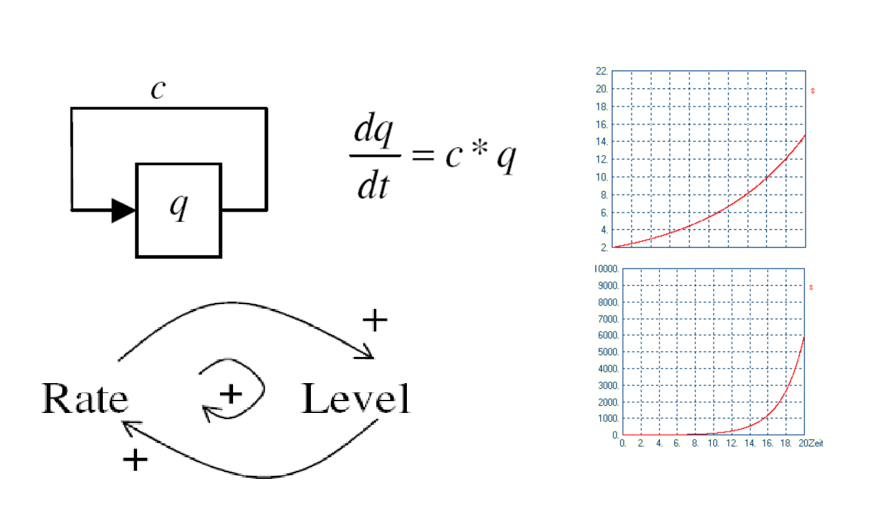

# Gängige Modelle

Elementare Grundmodelle sind:
- Exponentielles Wachstum / exponentieller Zerfall
- Verzögerungselement (1. Ordnung)
- Oszillatoren
- Regelkreise
- Populationsdynamik

## Exponentielles Wachstum

- Direkte positive Rückkopplung einer Größe auf ihre Änderungsrate
- Führt zu unbegrenztem Wachstum

Lineares Modell mit Wachstumsfaktor $c$

Beispiele:
- Bakterienwachstum unter idealen Bedingungen
- Virales Wachstum in sozialen Medien (Verbreitung von Posts)

## Exponentieller Zerfall
- Direkte negative Rückkopplung einer Größe auf ihre Änderungsrate
- Führt zu exponentiellem Abfall / Zerfall bis 0

Lineares Modell mit Verlustfaktor $c$

Beispiele:
- Radioaktiver Zerfall von instabilen Elementen
- Abbau von Medikamenten im Körper

## PT1-Glied

- Besteht aus:
    - Eingang
    - exponentiellem Zerfall
- Negative Rückkopplung führt zu einer vom Zustandswert abhängigen Abnahme
- Positiver Eingang führt zu einer Zunahme
- Stabil, wenn exponentieller Abfall gleich dem Eingang

Trägheit des PT1-Gliedes:
- Die Geschwindigkeit des Systems wird durch seine Trägheit verringert, sodass das System stabilisiert wird.
- Im Allgemeinen verwenden wir eine Verzögerungszeit $T_v$, die den Anstieg des Systemwertes bei Anfangszustand $0$ und Eingang $1$ beschreibt

Beispiele:
- Druck im System der mit Pumpe erzeugt wird
- Thermometer in wärmeres Wasser eintauchen

Eine Sprungantwort ist die Reaktion des Systems auf eine sprungförmige Änderung des Eingangssignals. Die Verzögerungszeit $T_v$ kann man grafisch aus der Sprungantwort des Systems ablesen in dem man eine Wende-Tangente an der Anstiegskurve anlegt.

