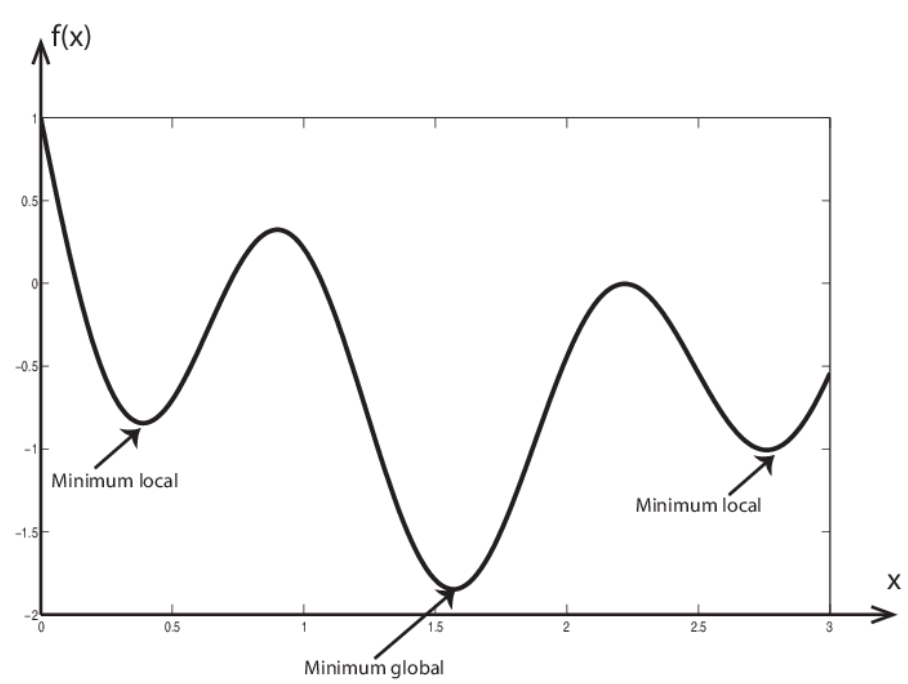
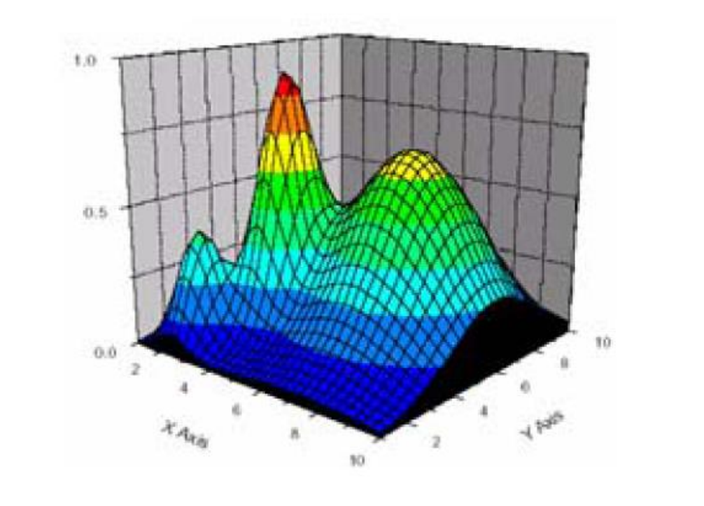
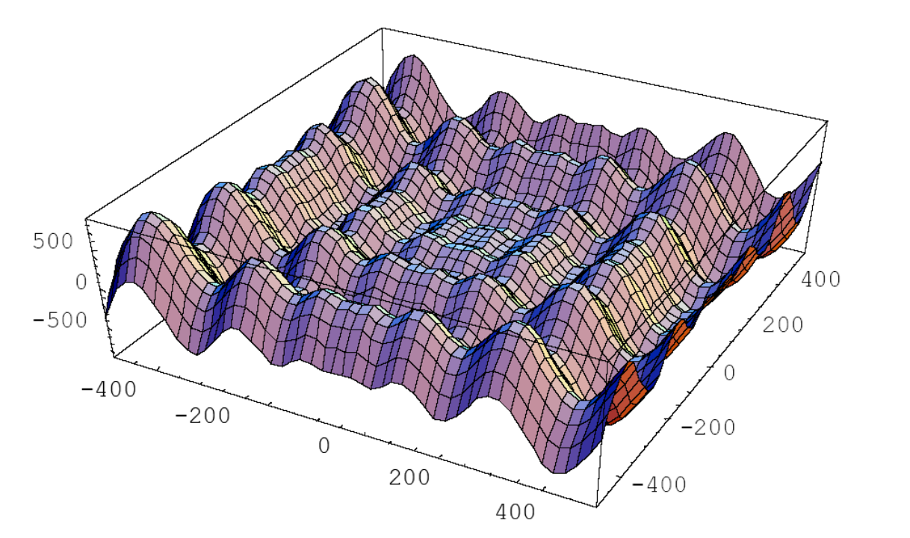
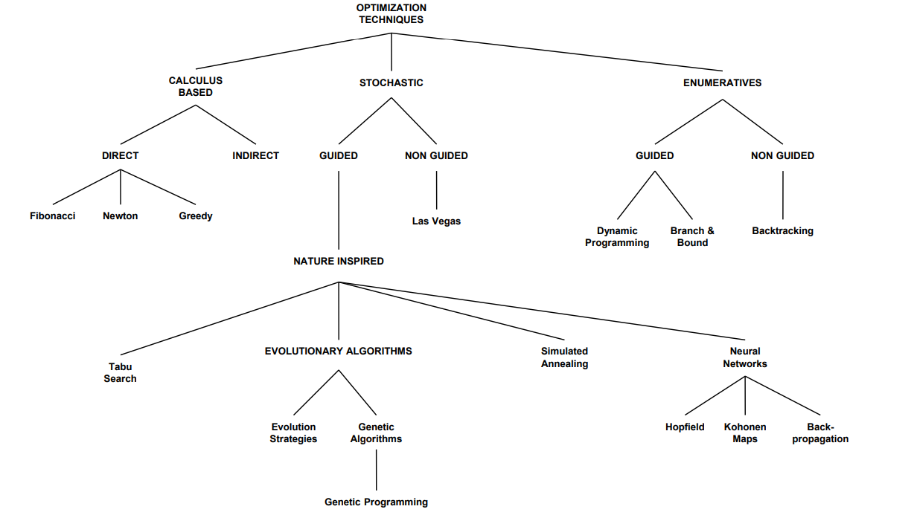

# Heuristische Optimierung

Heuristische Optimierung ist ein Ansatz zur Lösung komplexer Optimierungsprobleme, bei dem man nicht nach der perfekten, sondern nach einer "guten genug" Lösung sucht.

**Zielsetzung**:
- Finden guter (annähernd optimaler) Lösungen
- Akzeptable Laufzeit
- Keine Garantie für die absolute Optimalität der Lösung

>Der große Vorteil heuristischer Optimierung ist, dass sie auch bei sehr komplexen Problemen in akzeptabler Zeit zu brauchbaren Lösungen kommt, wo exakte Verfahren aufgrund der Problemgröße versagen würden. Der Nachteil ist, dass man meist nicht weiß, wie nah man am theoretischen Optimum ist.

## Optimierungsprobleme
- Eine Entscheidungs-Situation, bei der ein gegebener Nutzen auf kostenminimierende Art realisiert werden soll, wobei eine von mehreren Alternativen nach bestimmten Kriterien ausgewählt wird.
- Mathematisch ausgedrückt:
Es soll ein Eingabewert für eine Funktion gefunden werden, sodass die Funktion einen minimalen Wert annimmt, wobei es in der Regel eine Beschränkung für die Eingabewerte gibt.
Für gegebene Probleme werden Lösungen gesucht; wir verwenden eine Fitnessfunktion $f(x)$, um die Qualität einer Lösung $x$ zu berechnen.

## Lokale vs. Globale Optima

Eine Funktion $f$ an der Stelle $x_0 \in U  \subseteq \mathbb{R} $ ist ein:
- **lokales Minimum**, wenn es ein Intervall $I=[a,b]$ gibt, das $x_0$ enthält, sodass $f(x_0)  \leq f(x)$ für alle $x \in I \subseteq U$ gilt
- **lokales Maximum**, wenn es ein Intervall $I=[a,b]$ gibt, das $x_0$ enthält, sodass $f(x_0) \geq f(x)$ für alle $x \in I \subseteq U$ gilt
- **globales Minimum**, wenn es ein Intervall $I=[a,b]$ gibt, das $x_0$ enthält, sodass $f(x_0) \leq f(x)$ für alle $x \in U$ gilt
- **globales Maximum**, wenn es ein Intervall $I=[a,b]$ gibt, das $x_0$ enthält, sodass $f(x_0) \geq f(x)$ für alle $x \in U$ gilt

Der wesentliche Unterschied ist also:
- Bei **lokalen** Optima ist der Wert nur im Vergleich zur direkten Umgebung (Intervall $I$) optimal
- Bei **globalen** Optima ist der Wert im Vergleich zum gesamten Definitionsbereich ($U$) optimal

>Dieser Unterschied ist besonders wichtig in der Optimierung, da viele Algorithmen Gefahr laufen, in einem lokalen Optimum "stecken zu bleiben", ohne das globale Optimum zu finden.

## Unimodale vs. Multimodale Funktionen / Fitness-Landschaften

- Eine Funktion wird als **unimodal** bezeichnet, wenn sie nur **ein** Minimum/Maximum hat (global = lokal) d.h. nur eine bestmögliche Lösung
- Eine Funktion wird als **multimodal** bezeichnet, wenn sie **mehrere** lokale Extrema hat
- In der Praxis trifft man bei Optimierungsproblemen häufig auf hochgradig multimodale Lösungsräume

Bildlich gesprochen (würde man die Fitness-Landkarte als 3D-Plot visualisieren):
- **Unimodal**: Ein einzelnen Berg - es gibt nur einen Gipfel (Maximum) oder ein Tal (Minimum)
- **Multimodal**: Eine Gebirgslandschaft - es gibt viele lokale Gipfel und Täler, aber nur einer ist der höchste/tiefste Punkt

## Fitness-Landschaften

**Konzept zur Beschreibung von Suchräumen**
- Konzept zur Beschreibung von Suchräumen
- Jeder Lösung im Suchraum wird eine Höhe zugeordnet
- ein Punkt auf der Karte = Lösung
- Höhe des Punktes = Fitness der Lösung
- Punkte sind räumlich angeordnet
- Ähnliche Lösungen liegen in der Fitness-Landschaft nebeneinander, d.h der **Abstand** beschreibt, wie unterschiedlich zwei Lösungen sind
- Die **Nachbarschaft** einer Lösung sind alle Lösungen, die durch kleine Änderungen erreicht werden können

- **X-Achse**: Erster Parameter/Variable des Problems
- **Y-Achse**: Zweiter Parameter/Variable des Problems
- **Z-Achse** (Höhe): Der Fitness-Wert für diese Parameterkombination

In der Realität haben wir oft mehr als zwei Parameter, was zu mehrdimensionalen Räumen führt, die wir uns nicht mehr bildlich vorstellen können. Das Konzept der Fitness-Landschaft mit "Bergen" und "Tälern" bleibt aber das gleiche.

Der **Gradienten-Aufstieg** (engl.: *"gradient ascent"*) ist eine Optimierungsmethode, die sich bildlich gut mit der Fitness-Landschaft erklären lässt:
Stell dir vor, du stehst an einem Punkt in der Fitness-Landschaft und möchtest zum höchsten Gipfel gelangen. Der Gradient ist dabei die Richtung des steilsten Anstiegs von deiner aktuellen Position aus. Beim Gradienten-Aufstieg folgst du immer dieser steilsten Richtung nach oben.
> Diese Methode findet möglicherweise nur ein lokales Maximum (Du erreichst vielleicht nur einen kleineren Gipfel, nicht den höchsten Berg)

Anlaog zum Gradienten-Aufstieg gibt es auch den **Gradienten-Abstieg**.

### Hochgradig multimodale Lösungsräume

Die Landschaft ist hochgradig multimodal - man sieht viele "Berge" und "Täler", also viele lokale Optima. Diese Art von Landschaft stellt für Optimierungsalgorithmen eine besondere Herausforderung dar, weil:

- Es viele lokale Optima gibt, in denen ein Algorithmus "stecken bleiben" könnte
- Die regelmäßige Struktur irreführend sein kann
- Es schwierig ist zu erkennen, welcher der vielen Gipfel tatsächlich der höchste ist

### Fiktives Beispiel:
Die Optimierung einer chemischen Reaktion mit zwei Parametern:

- $X$ könnte die Temperatur sein
- $Y$ der Druck
- $Z$ die Ausbeute des gewünschten Produkts
Die vielen Gipfel würden dann verschiedene Bedingungen darstellen, unter denen die Reaktion gut läuft, aber nur einer ist optimal.

Mit Erweiterung der Fitness-Kriterien könnte man abhilfe schaffen und um eine andere Fitness-Landkarte erreichen.

Im Beispiel könnte man die Energiekosten als zusätzlichen "Straf-Term" einführen. ($f(x) = a_1 \cdot Ausbeute(x) - a_2 \cdot Energiekosten(x)$)
Dabei sind $a_1$ und $a_2$ Gewichtungsfaktoren sind, die die relative Wichtigkeit der Ziele bestimmen.
Das würde die Fitness-Landschaft grundlegend ändern:
- Hoher Druck würde nun "bestraft" werden
- Sehr hohe Temperaturen ebenso
- Das globale Optimum würde sich zu einem Punkt verschieben, der einen guten Kompromiss zwischen Ausbeute und Energieverbrauch darstellt

Solche gegensätzlichen Ziele sind in der Praxis sehr häufig, z.Bsp.
- Qualität vs. Kosten
- Geschwindigkeit vs. Energieverbrauch
- Leistung vs. Robustheit

## Multikriterielle Optimierung

**Multikriterielle Optimierung** beschäftigt sich mit Optimierungsproblemen, die mehrere Ziele haben. In diesem Kontext können verschiedene Ziele zueinander...
- komplementär (sich ergänzend)
- konkurrierend (gegensätzlich)
- neutral

...sein

**Hinweis**: Häufig wird die Zielfunktion eines multikriteriellen Optimierungsproblems als gewichtete Zusammensetzung betrachtet:
$f(x) = a_1 \cdot f_1(x) + a_2 \cdot f_2(x) + \dots + a_n \cdot f_n(x)$

Die Gewichtungsfaktoren ($a_1$, $a_2$, $\dots$) geben die relative Wichtigkeit der einzelnen Ziele wider.

### Fiktives Beispiel

Bei der Optimierung eines Autos könnten die Ziele sein:
- $f_1(x)$: Maximiere Leistung
- $f_2(x)$: Minimiere Kraftstoffverbrauch
- $f_3(x)$: Maximiere Sicherheit
- $f_4(x)$: Minimiere Produktionskosten

Die formulierten Ziele sind teilweise:
- konkurrierend (mehr Leistung = mehr Verbrauch)
- komplementär (mehr Sicherheit kann auch Leistung verbessern)
- neutral (Produktionskosten und Sicherheit können unabhängig sein)

## Klassifizierung von Optimierung-Algorithmen
Die Unterscheidung liegt  in der Herangehensweise:
- **Kalkulationsbasierte Methoden** nutzen mathematische Eigenschaften wie Ableitungen
- **Stochastische Methoden** verwenden Zufallselemente
- **Enumerative Methoden** durchsuchen systematisch den Lösungsraum

Interessant ist der große Bereich der naturinspirierten Algorithmen, die sich natürliche Prozesse zum Vorbild nehmen:

- **Evolutionäre Algorithmen** imitieren die biologische Evolution
- **Simulated Annealing** ist vom Abkühlungsprozess in der Metallurgie inspiriert
- **Neuronale Netze** basieren auf der Funktionsweise des Gehirns

Jeder dieser Ansätze hat seine spezifischen Vor- und Nachteile und eignet sich für unterschiedliche Arten von Optimierungsproblemen.

In der LVA haben wir uns nur mit Evolutionäre Algorithmen beschäftigt.

## Optimierungsprobleme

- Traveling salesman problem (TSP)
    - Ein Handelsreisender muss mehrere Städte besuchen und sucht die kürzeste Route
- Graph partitioning problem (GPP)
    - Aufteilung eines Graphen in Teilmengen unter bestimmten Bedingungen
- Graph bipartitioning problem (GBP)
    - Spezialfall des GPP mit genau zwei Teilmengen
- Quadratic assignment problem (QAP)
    - Optimale Zuordnung von Einrichtungen zu Standorten unter Berücksichtigung von Distanzen und Flüssen
- Transport optimization problem ((C)VRP)
    - Optimierung von Fahrzeugrouten für Warenauslieferung (C steht für "Capacitated" - mit Kapazitätsbeschränkungen)
- Backpacking / knapsack problem
    - Optimale Auswahl von Gegenständen mit begrenzter Kapazität
- Optimierung von Simulationsmodellen
    - z.Bsp.: Lunar Lander :smile:

Diese Probleme sind oft NP-hart, das heißt, es gibt keine effiziente Methode, um garantiert die optimale Lösung zu finden, weshalb heuristische Verfahren zum Einsatz kommen.

  
Exkurs NP-Problem (nicht wichtig)

- $P$ = Probleme, die mit einem deterministischen Algorithmus in polynomieller Zeit gelöst werden können (also "effizient" lösbar)
- $NP$ = Probleme, die mit einem nicht-deterministischen Algorithmus in polynomieller Zeit gelöst werden können
- $NP$-hart bedeutet, dass ein Problem mindestens so schwierig wie die schwersten Probleme in $NP$ ist.

Beispiele:
- P-Problem: Sortieren einer Liste (effizient lösbar)
- NP-schweres Problem: Traveling salesman problem (TSP)
    - Bei TSP wächst die Anzahl möglicher Routen exponentiell  (fakultativ) mit der Anzahl der Städte:
    - Bei 5 Städten: 120 mögliche Routen
    - Bei 10 Städten: 3.628.800 mögliche Routen
    - Bei 20 Städten: über 2 Trillionen mögliche Routen

