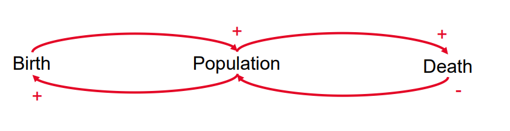
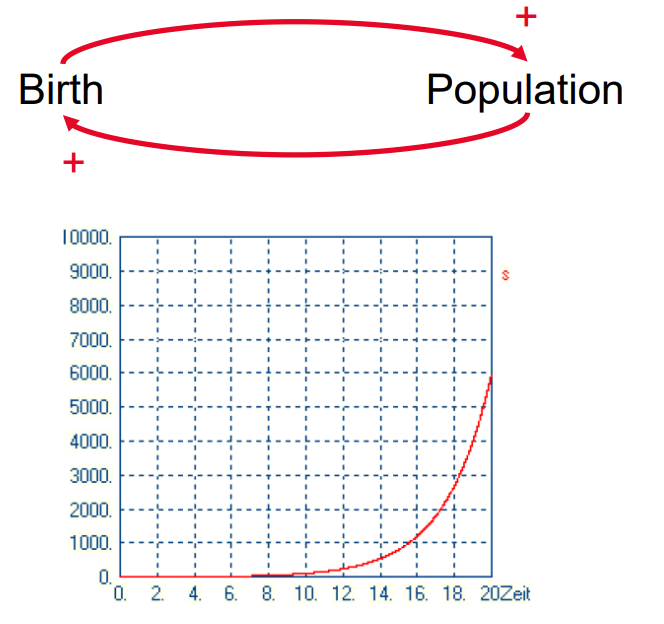
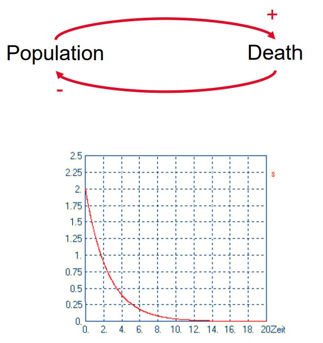
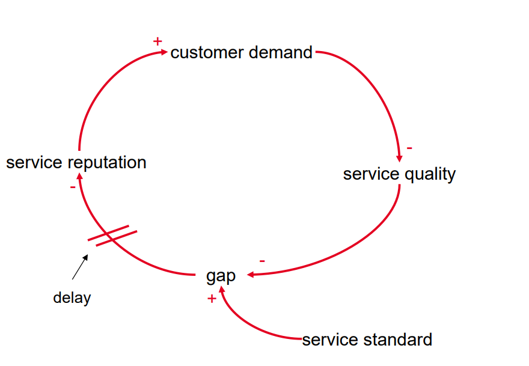
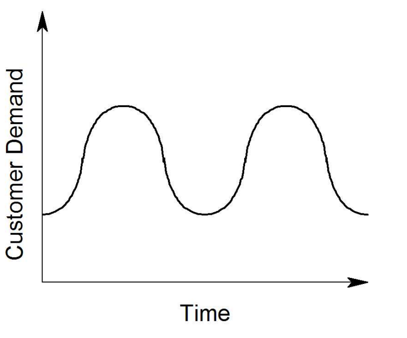
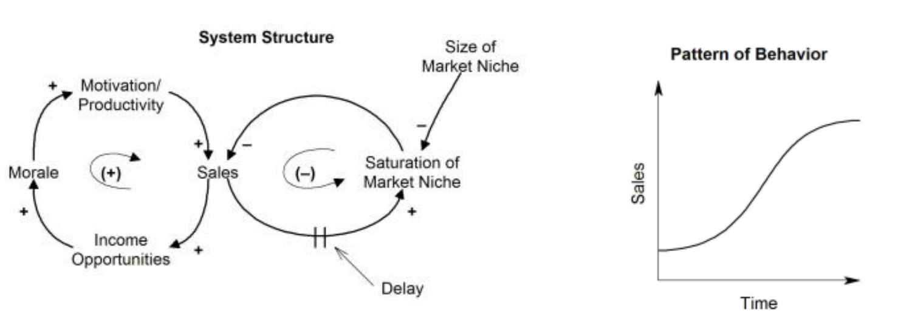

# Kontinuierliche Modelle

## Erinnerung
### Deduktive Modellierung
Modellierung basierend auf Wissen und Einsicht in den Prozess:
- Regeln, Gleichungen, Gesetze, Prinzipien
- Grundlegendes Wissen, Lehrsätze
- Strukturelles Wissen

Der deduktive Ansatz geht von bekanntem Wissen und Theorien aus und leitet daraus das Modell ab.

### Induktive Modellierung
Modellierung basierend auf gemessenen Daten zur Identifizierung und Verifizierung von Modellen:
- Beobachtungen, Messungen, Annahmen
- Statistische Ansätze, Data Mining, Künstliche Intelligenz

#### Prozess
- Modellgrößen
    - Identifikation der relevanten Größen im System
- Wechselbeziehungen und Rückkopplungsschleifen
    - Identifikation von Abhängigkeiten zwischen Modellvariablen
    - Klassifizierung der Abhängigkeiten in positive und negative
    - Identifikation von Rückkopplungsschleifen
- Modellierungsansatz
    - Identifikation der grundlegenden Modellgleichungen
- Parameteridentifikation
    - Genaue Schätzung/Identifikation von Parametern (Koeffizienten, Faktoren) im Modell
    - Wird das System bestmöglich abgebildet?

## Wechselbeziehungen (Interdependencies)
- Qualitative Identifikation von Ursache-Wirkungs-Beziehungen zwischen Modellvariablen
- Darstellung in einem Ursache-Wirkungs-Diagramm ("causal loop diagram")
- Kausale Wechselbeziehungen können sein:
    - positiv: Erhöhung des 1. Wertes führt zu Zunahme/Wachstum des 2. Wertes
    - negativ: Erhöhung des 1. Wertes führt zu Abnahme/Rückgang des 2. Wertes

## Rückkopplungsschleifen (Feedback Loops)

### Positive Rückkopplungsschleife
- verstärkende / selbstverstärkende Schleife
- Gerade Anzahl von negativen Wechselbeziehungen
- Effekt: Gewinn / Zunahme / Verstärkung

### Negative Rückkopplungsschleife
- Ausgleichende oder zielsuchende Schleife
- Ungerade Anzahl von negativen Wechselbeziehungen
- Effekt: Stabilisierung

### Negative Rückkopplungs-Schleifen mit Verzögerung

**Negative** Rückkopplungs-Schleifen mit Verzögerungen (Delay) können zu Oszillationen führen. Es gibt Systeme die endlos oszillieren, aber auch jene, bei denen die Schwingungs-Amplitude graduierlich abnimmt.

### Kombination aus positiver und negativer Rückkopplungsschleife

Wenn positive und negative Schleifen kombiniert werden, sind verschiedene Muster möglich. Das obige Beispiel zeigt eine Situation, in der eine positive Rückkopplungsschleife zunächst zu einem exponentiellen Wachstum führt, aber dann, nach einer Verzögerung, eine negative Rückkopplungsschleife das Systemverhalten dominiert. Diese Kombination führt zu einem S-förmigen Muster, weil die positive Rückkopplungsschleife anfangs exponentielles Wachstum verursacht, und dann, wenn die negative Rückkopplungsschleife übernimmt, ein ausgleichendes Verhalten entsteht.

