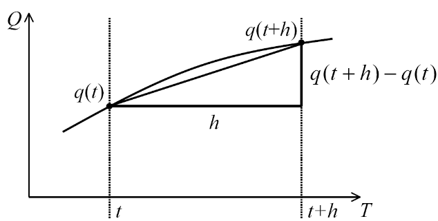
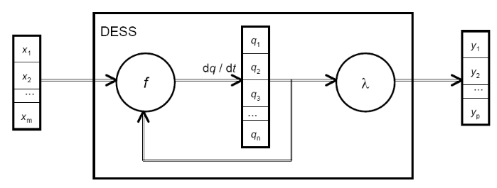
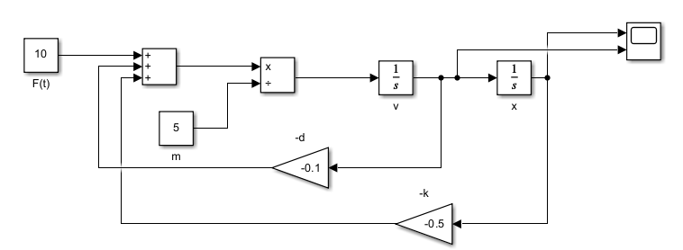
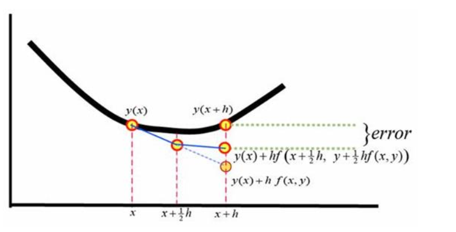

# Kontinuierliche Simulation

## Differentialquotient
Der Differentialquotient gibt die **momentane, lokale Änderungsrate** einer Funktion an einer Stelle an -> Tangentensteigung (z.B. Momentangeschwindigkeit).

Beispiel:

Berechnung: 

$g'(t) = \frac{dq}{dt} = \lim_{h \to 0} \frac{g(t+h) - g(t)}{h}$

## Differential Equation Specified Systems (DESS)
DESS sind Systeme, die durch Differentialgleichungen beschrieben werden.

### Komponenten des DESS:
* **DESS = <X, Y, Q, f, λ>**

- **X (Eingabedomain)**:
   - Bereich der Eingabewerte (z.b. Steuergröße, äußere Anregung)

- **Y (Ausgabedomain)**:
   - Bereich der Ausgangswerte des Systems (z.B. Messgröße, Reaktion des Systems)	

- **Q (Menge der Zustände)**:
   - Zustände sind durch Variablen definiert, beschreiben das System zu einem bestimmten Zeitpunkt vollständig

- **f (Änderungsrate / Ableitungsfunktion)**:
   - Differentialgleichung, die angibt, wie sich die Zustände im Zeitverlauf verändern.

- **λ (Ausgabefunktion)**:
   - Ausgabe des Systems in Abhängigkeit von den Zuständen und Eingaben, gibt an, wie das System auf die aktuellen Zustände und Eingaben reagiert

### Beispiel (mit Blockorientierte Beschreibung von Differentialsystemen)
X ($= x1,x2,x3,...,x_n$) Y ($= y1,y2,y3,...,y_n$) und Q ($= q1,q2,q3,...,q_n$):

### Beispiel: Lineares Oszillationssystem basierend auf Newtonschen Mechanik.
- Grundsatz:
    - $ m \cdot a = \sum F \rightarrow $ "Masse * Beschleunigung = Summe aller Kräfte"
    
- Beschreibung:
    - Masse $ m $, die sich horizontal bewegen kann
    - Feder $ k $, die die Masse zurück zur Ruhelage zieht
    - Dämpfer $ d $, der die Bewegung der Masse verlangsamt
    - äußeren Kraft $ F(t) $, die auf die Masse wirkt
    - Position der Masse $ x $
    - Geschwindigkeit der Masse $ v $
    - 
- Bewegungsgleichung:
    - $ m \frac{d^2x}{dt^2} = F(t) - kx - dv $
- Zustandsraumdarstellung:
    - $ \frac{dx}{dt} = v \rightarrow $
    - $ \frac{dv}{dt} = \frac{d^2x}{dt^2} = \frac{1}{m} (F(t) - kx - dv) $
    - 

### Beispiel: Mondlandung - siehe Unterlagen :)

## Numerische Integration
- **Problem Formulierung**
    - Gegeben: aktueller Zustand
    - Gegeben oder berechenbar: Änderungsrate
    - Gesucht: Input 

- **Frage:** Wie können die zukünftigen Zustandswerte berechnet werden?

- **Lösung -> Numerische Integration (Berechnung durch diskrete Schritte)**
    - **Integrationspunkte (Samples):** Zeitpunkte, an denen der Zustand berechnet wird.
    - **Approximation / Schätzung:** Der nächste Zustandswert wird basierend auf bekannten Werten und einem gewählten Integrationsverfahren geschätzt.

- **Theoretisch exakte Lösung: Taylor-Reihe**
    - $ q_{i+1} = q_i + h \cdot f(q_i) + \frac{h^2}{2!} \cdot f'(q_i) + \frac{h^3}{3!} \cdot f''(q_i) + ... $
    - Erklärung: der Funktionswert an der nächsten Stelle wird als eine unendliche Summe von Ableitungen an der aktuellen Stelle berechnet/aproximiert.
    - In der Praxis ist das jedoch oft nicht möglich -> Näherungsmethoden werden verwendet
    - Die anderen Integrationsmethoden werden mit Taylor-Reihen verglichen, um den Fehler zu bestimmen -> $(O(h^2))$, wobei $h$ die Schrittweite ist.

## Numerische Integration Methoden
### Euler-Verfahren
- $ q_{i+1} = q_i + h \cdot f(q_i) $
- lokaler Fehler (Fehler nach einem Schritt): $O(h^2)$
- globaler Fehler (Fehler über alle Schritte): $O(h)$

### Heun-Verfahren
- $ q_{i+1} = q_i + \frac{h}{2} \cdot (f(q_i) + f(q_i + h \cdot f(q_i))) $
- lokaler Fehler: $O(h^3)$
- globaler Fehler: $O(h^2)$

### Runge-Kutta-Verfahren
- Berechnung:
    - $ k_1 = h \cdot f(q_i) $
    - $ k_2 = h \cdot f(q_i + \frac{k_1}{2}) $
    - $ k_3 = h \cdot f(q_i + \frac{k_2}{2}) $
    - $ k_4 = h \cdot f(q_i + k_3) $
    - $ q_{i+1} = q_i + \frac{1}{6} \cdot (k_1 + 2k_2 + 2k_3 + k_4) $
- lokaler Fehler: $O(h^5)$
- globaler Fehler: $O(h^4)$
- Schrittweite wird halbiert wenn der Fehler zu groß ist

### Runge-Kutta-Verfahren mit automatischer Schrittweitenanpassung
- Vergleich der Werte von 5. Ordnung und 6. Ordnungsverfahren -> die Differenz wird für die Schrittweitenanpassung verwendet
- Berechnung:
    - $ k1 = h \cdot f(q_i) $
    - $ k2 = h \cdot f(q_i + b_{21} \cdot k1) $
    - ...
    - $ k6 = h \cdot f(q_i + b_{61} \cdot k1 + b_{62} \cdot k2 + ... + b_{65} \cdot k5) $
    - $ q_{i+1} = q_i + \sum_{j=1}^{6} c_j k_j (+O(h^6)) $
    - $ q'_{i+1} = q_i + \sum_{j=1}^{6} c'_j k_j (+O(h^5)) $
    - b sind die Zwischenstufen-Koeffizienten (geben an, wie frühere k-Werte in die Berechnungen nächster Schritte einfließen) 
    - c sind die Gewichtungskoeffizienten (geben an, wie die k-Werte gewichtet werden)

### Multi Step Verfahren
- Runge Kutta Verfahren = Ein-Schritt-Verfahren -> nur aktuelle Information wird für die Berechnung des nächsten Schrittes verwendet
- Multi Step Verfahren -> nicht nur aktuelle, sondern auch vergangene Werte werden miteinbezogen
    - schwierig am Start der Simulation, da man keine vergangenen Werte hat
    - besseres Laufzeitverhalten aber viel komplizierter zu implementieren
    - Adams-Bashforth-Verfahren
        - explizit = nur Werte aus der Vergangenheit werden verwendet
    - Adams-Moulton-Verfahren
        - implizit = Werte aus der Zukunft werden auch verwendet
        - Zukunftswerte werden durch ein explizites Verfahren berechnet

### Verfahren für "steife" ("stiff") Systeme
- Steife Systeme: schnelle Veränderungen, schneller Zerfall
- Problem:
    - man braucht eine kleine Schrittweite, um die schnellen Veränderungen zu erfassen
    - nach dem Zerfall muss die Schrittweite erhöht werden
- Lösung:
    - z.b. Method of Gear
    - MATLAB: ode15s, ode23s, ode23t, ode23tb
    - Also Verfahren mit automatischer Schrittweitenanpassung

### Wann soll ich welches Verfahren verwenden?
- Meistens Runge-Kutta-Verfahren
    - einfach
    - Differentialgleichungen werden oft ausgeführt
- Wenn die Laufzeit ein wichtiger Faktor dann Multi Step Verfahren betrachten
- Wenn steife Systeme dann Verfahren für steife Systeme verwenden

## Zusammengefasst

### Modellierung mit Differentialgleichungssystemen
- **Schätzung von Zustandswerten**
- **Spezifikation der Änderungsraten der Zustandsvariablen**
- **Deduktive Modellierung basierend auf physikalischen Gesetzen**
- **Induktive Modellierung basierend auf Observationen und Anpassung**

### Simulation mittels numerischer Integration
- **Numerische Integrationsmethoden**
- **Schrittweiten- und Schrittweitenkontrolle**

### Probleme / Fragen / Herausforderungen

#### Modellierung
- **Identifikation gültiger Differentialgleichungen**:
  - In den Naturwissenschaften und der Technik relativ einfach, da die zugrunde liegenden Gesetze bekannt sind. Trotzdem können die Modelle mathematisch sehr komplex sein.
  - In Bereichen wie Biologie, Physiologie oder Sozialwissenschaften ist es schwieriger, gültige Modelle zu finden. Dort werden oft vereinfachte Modelle verwendet.
- **Umformulierung von impliziten Gleichungen in explizite Zustandsgleichungen**
- **Gültigkeit / Validierung der Modelle**

#### Simulation
- **Finden der geeigneten Simulationsmethode und Simulationsschrittweite**
- **Berechnungsgenauigkeit**
- **Gültigkeit / Validierung der Ergebnisse**

