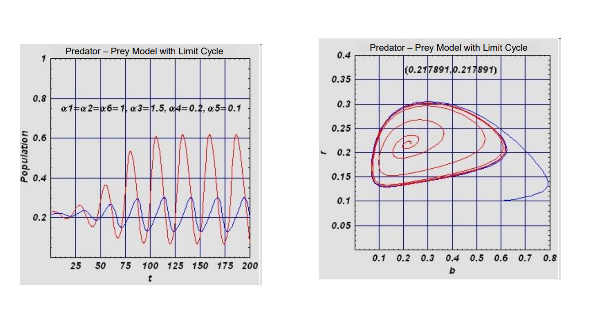
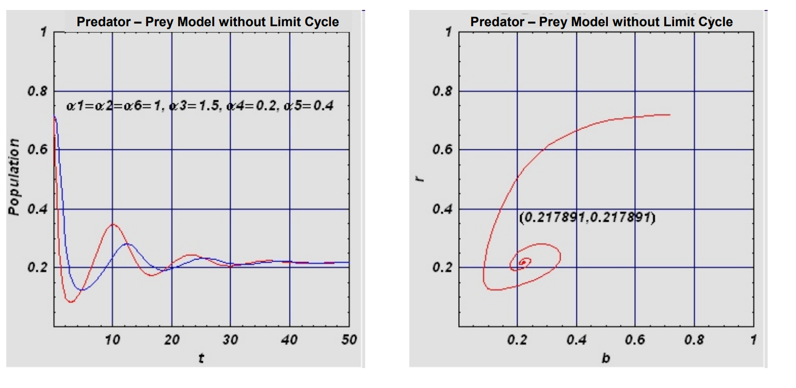

# Räuber-Beute Modelle
Predator-Prey (Räuber-Beute) Modelle beschreiben die Wechselwirkungen zwischen Räuber- und Beutepopulationen in einem Ökosystem.

Grundprinzipien:

- Die Modelle beschreiben, wie sich die Populationsgrößen von Räubern und Beutetieren gegenseitig beeinflussen
- Sie zeigen typischerweise zyklische Schwankungen: Wenn es viele Beutetiere gibt, können sich die Räuber stark vermehren. Dies führt dann zu einem Rückgang der Beutepopulation, woraufhin auch die Räuberpopulation abnimmt
- Ohne Räuber würde die Beutepopulation exponentiell wachsen
- Ohne Beute würde die Räuberpopulation exponentiell abnehmen

## Lotka-Volterra Gleichungen
Das klassische Lotka-Volterra-Modell beschreibt Wechselwirkungen zischen Populationen von Räubern und Beutetieren.

- Beute **b** (die einen idealen Lebensraum haben, außer:)
- Räuber **r** (die von der Beute abhängig sind)

Ohne **b** würde **r** gemäß der Zerfallsregel $r'(t)=-γ r(t), γ>0$, aufgrund von Nahrungsmangel abnehmen. Die Anwesenheit von **b** ermöglicht die Vermehrung von **r**; diese Rate hängt von der Häufigkeit der Begegnungen zwischen Räuber und Beute ab.

- Wir nehmen an, dass diese Rate proportional zum Produkt $b(t)r(t)$ ist.
- Ähnliche Überlegungen führen zu Änderungsraten bei den Räubern.
- Diese Wechselwirkungen zwischen **b** und **r** führen uns zu den bekannten Lotka-Volterra Gleichungen

$b(t)$ ... die Beutepopulation zum Zeitpunkt $t$
$r(t)$ ... die Räuberpopulation zum Zeitpunkt $t$
$γ$ ...die natürliche Sterberate der Räuber ohne Beute
$b(t)r(t)$ die Wahrscheinlichkeit der Begegnung zwischen Räuber und Beute

```math
db(t)/dt = α b(t) - β b(t)r(t) \\
dr(t)/dt = -γ r(t) + δ b(t)r(t) \\
α>0, \ β>0, \ γ>0,\ δ>0, \ t≥0
```

$db(t)/dt$ ... beschreibt die Änderungsrate der Beutepopulation
$dr(t)/dt$ ... beschreibt die Änderungsrate der Räuberpopulation
$α$ ... ist die natürliche Wachstumsrate der Beute
$β$ ... beschreibt die Rate, mit der Beute von Räubern gesnackt wird
$γ$ ... ist die natürliche Sterberate der Räuber
$δ$ ... beschreibt die Effizienz, mit der Räuber Beute in eigenes Populationswachstum umwandeln
$t$ ... you guessed it, die Zeit

Aufgrund des Produktterms $b(t)r(t)$ ist dieses System nichtlinear, und die Wechselwirkung führt zu periodischen Phänomenen.

Wir können zeigen, dass der Durchschnittspunkt der Populationen $(M(b),M(r))$ über eine beliebige Trajektorie identisch mit dem Equilibrium ist:

```math
M(b) = (1/T)∫ᵗ⁽ᵗ⁺ᵀ⁾b(τ)dτ = γ/δ \\
M(r) = (1/T)∫ᵗ⁽ᵗ⁺ᵀ⁾r(τ)dτ = α/β
```

Die Aussage bedeutet nun: Wenn man den Durchschnitt über einen vollständigen Zyklus berechnet, erhält man interessanterweise genau den gleichen Punkt, der auch der Gleichgewichtspunkt wäre.

Beispiel:

- Die Beutepopulation schwankt zwischen 80 und 120 Tieren
- Die Räuberpopulation schwankt zwischen 30 und 70 Tieren
- Der Durchschnitt wäre dann bei etwa 100 Beutetieren und 50 Räubern
- Dieser Durchschnittspunkt (100,50) wäre dann auch der theoretische Gleichgewichtspunkt, bei dem beide Populationen stabil bleiben würden - wenn sie denn jemals diesen Punkt erreichen würden.

Das zeigt, dass die durchschnittlichen Populationsgrößen vorhersagbar sind, auch wenn die tatsächlichen Populationen ständig schwanken.


## Volterra-Prinzip
Wenn zwei Tierpopulationen (Räuber vs. Beute) beide durch äußere Faktoren (wie zum Beispiel Fischfang) reduziert werden, dann steigt der Durchschnitt der Beute und der Durchschnitt der Räuberpopulation sinkt.

Wenn wir annehmen, dass der Fischfang die Populationen proportional zu ihrer Größe dezimiert (mit verschiedenen Zerfallskonstanten $ε₁$ und $ε₂$ für Räuber und Beute), dann ist der Mittelwert $M$ über eine Periode:
$M(b) = (γ+ε₂)/δ$
$M(r) = (α-ε₁)/β$
Dies ist ein wichtiges Prinzip, das erklärt, warum externe Eingriffe oft unerwartete Auswirkungen auf das ökologische Gleichgewicht haben können.

## Equilibrium berechnen

Die Gleichgewichtspunkte werden berechnet als:

```math
db(t)/dt = 0 = (α - β r) b \\
dr(t)/dt = 0 = (-γ + δ b) r
```

Die erste Lösung ist trivial: $b = r = 0$; das interessiert niemanden

Die zweite Lösung ist nicht-trivial:
$bₘ = γ/δ$ und $rₘ = α/β$

Daraus kann man widerum schließen:
- Ohne natürliche Feinde vermehrt sich die Beute ungebremst
- Ohne Beute sterben die Räuber aus
- Es gibt zwei mathematische Lösungen für ein Gleichgewicht:
    - Beide Populationen sind ausgestorben $(b = r = 0)$
    - Ein stabiler Gleichgewichtspunkt, bei dem beide Populationen überleben können ($bₘ = γ/δ$ und $rₘ = α/β$)

## Räuber-Beute-Modell mit Grenzzyklen (Limit-Cycles)

Ein realistischeres Modell für die Untersuchung zweier Populationen sollte in der Lage sein, externe Störungen zu kompensieren, d.h. von selbst in einen stabilen Zustand zurückzukehren.

```math
db(t)/dt = b(t)(α₁(1-b(t)/α₂) - α₃r(t)/(b(t)+α₄)) \\
dr(t)/dt = r(t)α₅(1 - α₆r(t)/b(t))
```
$α₁ \dots α₆ > 0$ und $t≥0$

- $α₁$: Wachstumsrate der Beute
- $α₂$: Kapazitätsgrenze für die Beute (maximale Beutepopulation)
- $α₃$: Jagdeffektivität der Räuber
- $α₄$: Sättigungsparameter für die Jagd
- $α₅$: Wachstumsrate der Räuber
- $α₆$: Umwandlungseffizienz (wie effizient Beute in Räuberwachstum umgewandelt wird)

Der Hauptunterschied zum einfachen **Lotka-Volterra-Modell** ist:
- Das Modell enthält zusätzliche Terme, die das Wachstum begrenzen
- Es kann nach Störungen selbstständig zu einem stabilen Zustand zurückkehren
- Es ist realistischer, da es Sättigungseffekte berücksichtigt
- Es verwendet sechs Parameter ($α₁$ bis $α₆$) für eine genauere Modellierung der Populationsdynamik

Wenn es keine Räuber gibt (d.h. wenn $r(t) = 0$), dann folgt die Beute $b(t) $einem logistischen Wachstum mit dem Grenzwert $α₂$.

Für sehr kleine Beutepopulationen reduziert sich der Effekt der Räuber auf den bilinearen Term $-(α₃b(t)r(t))/α₄$. "Bilinear" bedeutet hier, dass der Term sowohl von $b$ als auch von $r$ linear abhängt, d.h. bei wenig Beute ist die Jagdeffizienz proportional zu beiden Populationsgrößen.
Für sehr große Populationen wird er linear $(-(α₃r(t)))$ und unabhängig von der Beutepopulation. Dieser Term hängt nur noch linear von $r$ ab, nicht mehr von $b$, d.h. Bei sehr viel Beute wird die Jagdeffizienz nur noch durch die Anzahl der Räuber begrenzt.

Dieser Ansatz ist vernünftig, weil die Abnahmerate einen Sättigungswert erreicht, der proportional zur Räuberpopulation ist (im Fall von sehr großen Beutepopulationen).

Wenn die Beutepopulation $b(t)$ durch äußere Einwirkungen konstant gehalten wird, dann ist die Gleichung für die Räuber eine Verhulst-Gleichung.

Wichtigste Unterschiede zum einfachen Modell:
- Es berücksichtigt logistisches Wachstum bei der Beute
- Es modelliert Sättigungseffekte bei großen Populationen
- Es zeigt realistischeres Verhalten bei extremen Populationsgrößen
- Die Verhulst-Gleichung beschreibt ein begrenztes Wachstum der Räuberpopulation

Es kann gezeigt werden, dass 3 der 6 gegebenen Parameter durch geeignete Transformation von $b$, $r$ und $t$ auf $1$ reduziert werden können ($α₁=α₂=α₆=1$). Die verbleibenden Parameter bestimmen das Langzeitverhalten des Systems.

Bsp.
- 1.) $α₃=1.5, \ α₄=0.2, \ α₅=0.1$
- führt zu einem stabilen Grenzzyklus
(System schwingt sich auf eine bestimmte Oszillation ein)



- 2.) $α₃=1.5, \ α₄=0.2, \ α₅=0.4$
- führt zu einem stabilen Gleichgewichtspunkt
(System nähert sich einem festen Punkt an)
- man beachte: nur die kleine Änderung von **$α₅$** führt dies herbei



