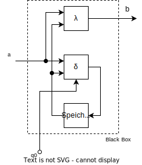
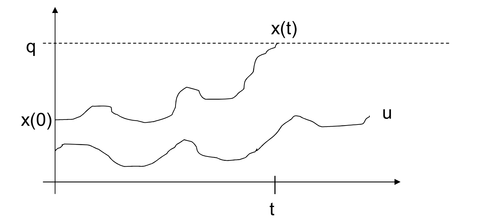
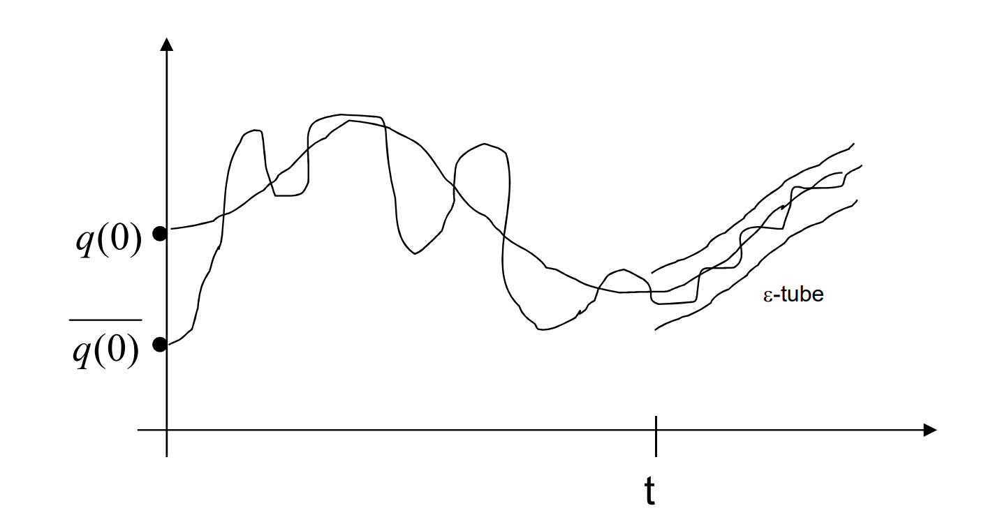
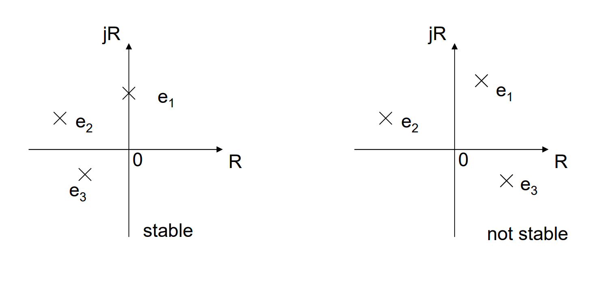

# System-Theorie-Basics
Die Systemtheorie bietet damit einen einheitlichen Rahmen zur Beschreibung unterschiedlichster Systeme - von technischen über biologische bis hin zu sozialen Systemen - und ermöglicht deren systematische Analyse und Steuerung.


## Aspekte der System-Theorie

Im allgemeinen Fall werden die Inputs nicht von den Interaktionen der Komponenten beeinflusst.

Mathematisch wird ein allgemeines dynamisches System als 6-Tupel formuliert:
$S=(T, A, B, Q, \delta, \lambda)$ (System, Automat)
- $T$ Zeitdomäne (Zeitbereich)
- $A$ Eingangsdomäne (Eingangsbereich)
- $B$ Ausgangsdomäne (Ausgangsbereich)
- $Q$ Zustands-Menge
- $\delta : Q \times A \rightarrow Q$ globale Zustandsübergangsfunktion
- $\lambda : Q \times B \rightarrow Q$ Ausgabefunktion

Die Zustandsübergangsfunktion $\delta$ definiert, wie sich der Systemzustand basierend auf dem aktuellen Zustand und Eingang ändert. Die Ausgabefunktion $\lambda$ bestimmt, welche Ausgabe das System bei gegebenem Zustand und Eingang erzeugt.

## Allgemeines Dynamisches System


- $a$ ist ein konkreter Eingabewert aus der Eingabemenge $A$
- $b$ ist ein konkreter Ausgabewert aus der Ausgabemenge $B$
- $q_0$ Anfangszustand (somit auch ein konkreter Zustand aus der Zustandsmenge $Q$)
- $\delta : Q \times A \rightarrow Q$ globale Zustandsübergangsfunktion
- $\lambda : Q \times B \rightarrow Q$ Ausgabefunktion

## Lineare Differentialsysteme

Lineare Differentialsysteme beschreiben, wie sich der Zustand des Systems über die Zeit verändert und wie der Ausgang von dem aktuellen Zustand abhängt.

---

Wie sich der Zustand des Systems über die Zeit verändert beschreibt die 
**Zustandsgleichung** (State Equation)
```math
x'(t) = Ax(t)+Bu(t)
```
```math
X'=AX+BU
```
Beide Notationen der Gleichung beschreiben dasselbe: Die Änderung des gesamten Zustandsvektors (alle Zustände gleichzeitig) in Abhängigkeit vom aktuellen Zustand und den Eingängen.

---

Wie der Ausgang von dem aktuellen Zustand abhängt beschreibt die
**Ausgangsgleichung** (Output Equation)
```math
y(t) = Cx(t) 
```
```math
Y=CX
```
Auch hier beschreiben beide Notationen dasselbe: Wie sich der gesamte Ausgangsvektor aus dem Zustandsvektor ergibt.

---

**Definitionen**:
- $X$ ... Zustandsvektor (State vector)
- $x(t)$ Zustandsvektor zum Zeitpunkt t
- $x'(t)$ zeitliche Ableitung des Zustandsvektors
- $A$ ... Systemmatrix
- $B$ ... Eingangsmatrix
- $U$ ... Eingangsvektor (Input signal vector)
- $u(t)$ ... Eingangsvektor zum Zeitpunkt $t$
- $Y$ ... Ausgangsvektor (Output signal vector)
- $y(t)$ ... Ausgangsvektor zum Zeitpunkt t
- $C$ Ausgangsmatrix

### Bedeutung der $A, B, C$-Matrizzen
- **Matrix $A$ (Systemmatrix)**: Beschreibt, wie sich das System aus sich selbst heraus entwickelt bzw. wie die Zustände sich gegenseitig beeinflussen. Jede System-Variable kann von anderen System-Variablen beeinflusst werden.
- **Matrix $B$ (Eingangsmatrix)**: Beschreibt, wie die Eingangssignale auf die Zustandsgrößen einwirken bzw. wie stark die Eingänge die verschiedenen Zustände beeinflussen. Jede Systemvariable kann von den Eingängen beeinflusst werden.
- **Matrix C (Ausgangsmatrix)**: Beschreibt, wie sich die internen Zustände auf die Ausgangssignale abbilden bzw. wie die Zustände die Ausgänge beeinflussen. Jeder Zustand kann sich auf die Ausgänge auswirken.

$A$, $B$ und $C$ sind Matrizen, die aus reellen Zahlen bestehen.

Die Dimensionen sind folgendermaßen bestimmt (Höhe $\times$ Breite):
- $A$ ist eine $n \times n$ Matrix ($n$ = Anzahl der Zustände)
- $B$ ist eine $n \times m$ Matrix ($m$ = Anzahl der Eingänge)
- $C$ ist eine $p \times n$ Matrix ($p$ = Anzahl der Ausgänge)

Die Komponenten dieser Matrizen sind konstant für ein lineares, zeitinvariantes System - sie ändern sich also nicht mit der Zeit.

### Ein einfaches Beispiel

- 3 Zustände ($n=3$)
- 2 Eingänge ($m=1$)
- 1 Ausgang ($p=1$)

```
A = [1  2  0]    B = [1  0]    C = [1  0  2]
    [0  1  3]        [0  1]
    [2  1  1]        [1  1]
```
**Interpretation:**

Die Matrix $A$ (3×3) beschreibt die interne Dynamik des Systems:
- Erste Zeile: Wie $x_1'$ von $x_1$, $x_2$, $x_3$ abhängt
- Zweite Zeile: Wie $x_2'$ von $x_1$, $x_2$, $x_3$ abhängt
- Dritte Zeile: Wie $x_3'$ von $x_1$, $x_2$, $x_3$ abhängt

Die Matrix $B$ (3×2) beschreibt wie die zwei Eingänge auf die drei Zustände wirken:
- Erste Zeile: $u_1$ beeinflusst $x_1$ mit $1$, $u_2$ mit $0$
- Zweite Zeile: $u_1$ beeinflusst $x_2$ mit $0$, $u_2$ mit $1$
- Dritte Zeile: beide Eingänge beeinflussen $x_3$ mit $1$

Die Matrix C (1×3) beschreibt wie der eine Ausgang von den drei Zuständen abhängt:
- $y = 1 \cdot x_1 + 0 \cdot x_2 + 2 \cdot x_3$
Der Zustand $x_2$ hat also keine direkte Auswirkung auf den Ausgang, jedoch wird indirekt über die Beeinflussung anderer Systemzustände auch Einfluss auf den Ausgang genommen. 

### Allgemeine Darstellung als Blockschaltbild


### Konkretes Beispiel als Blockschaltbild

```
A = [1  2  0]    B = [1  0]    C = [1  0  2]
    [0  1  3]        [0  1]
    [2  1  1]        [1  1]
```


> Zum besseren Verständnis habe ich hier noch eine eingefärbte Variante angefertigt.


## TODO: Formel für numerische Lösung einfügen und erklären

## Eigenschaften von A,B,C- Systemen
In der LVA haben wir 3 Eigenschaften näher behandelt:
- Steuerbarkeit
- Beobachtkarbeit
- Stabilität

### Steuerbarkeit (Controllability)

- Ist ein wichtiger Aspekt in vielen Regelungsproblemen (Stabilisierung instabiler Systeme durch Rückkopplung, optimale Regelung, ...)
- Steht in Verbindung mit Beobachtbarkeit
- Steuerbarkeit eines Zustands = ein Zustand kann durch geeignete Steuersignale in jeden beliebigen Zustandswert überführt werden -> Bedingung: repräsentative Steuersignale zur Steuerung des Zustands (im zulässigen Eingangsbereich des Systems liegen, realisierbar sein, ...)
- Ein System ist steuerbar, wenn alle Zustände steuerbar sind

Die Steuerbarkeit beschreibt, ob und wie ein System durch Eingangssignale gezielt beeinflusst werden kann.

**Formale Definition:**
```math
x_{controllable} \Leftrightarrow \forall_{q \in \mathfrak{R}^n} \exists_{u \in U} \exists_{t \in \mathfrak{R}^+ } : x(t) = q 
```

In prosa ist das gar nicht so kompliziert:

Ein System ist steuerbar, wenn ...
- man von jedem Startpunkt (x(0))
- zu jedem gewünschten Zielpunkt (q)
- in endlicher Zeit (t)
- durch ein zulässiges Steuersignal (u)

...gelangen kann.


$q$ ... Sollwert
$x(0)$ ... Anfangs-Zustand
$u$ ... Steuer-Input
$t$ ... Zeitpunkt des Erreichens des Sollzustandes

**Steuerbarkeitskriterium nach Kalman:**
Ein System $(A, B)$ ist vollständig steuerbar dann und nur dann, wenn die Steuerbarkeitsmatrix $S_c = [B \ AB \ A^2B \dots A^{n-1}B]$ den Rang $n$, d.h. $rk(S_c)=n$ hat.
Nicht steuerbar: Prozesse, die nicht mit den Eingängen verbunden sind.

Bedeutung in prosa:
Der "Rang $n$" bedeutet: Es muss genügend unabhängige Möglichkeiten geben, um jeden Teil des Systems zu beeinflussen.

### Beobachtbarkeit (Observability)
Gibt an, inwieweit die inneren Zustände aus den Systemausgängen abgeleitet werden können


**Formale Definition:**
```math
x(0)_{observable} \Leftrightarrow \forall_{u \in U} \exists_{u \in U} \exists_{t \in \mathfrak{R}^+ } \exists_{f} : f(u^t,y^t) = q_0 
```
In Prosa:

Beobachtbarkeit bedeutet, dass man durch das Beobachten der Ein- und Ausgangssignale eines Systems auf seine inneren Zustände schließen kann. Man kann also "von außen" erkennen, was "innen" im System los ist.

**Beobachtbarkeitskriterium nach Kalman:**

Ein System $(A,B,C)$ ist vollständig beobachtbar dann und nur dann, wenn die Beobachtbarkeitsmatrix $S_O=[C^T A^TC^T \dots (A^T)^{n-1}C^T]$ den Rang $n$ hat, d.h. $rk(SO) = n$

Die Beobachtbarkeit ist damit das "Gegenstück" zur Steuerbarkeit: Während die Steuerbarkeit beschreibt, ob man einen Zustand erreichen kann, beschreibt die Beobachtbarkeit, ob man einen Zustand erkennen kann.

## Stabilität

Stabilität wird dadurch definiert, dass kleine Abweichungen vom ursprünglichen Zustand $q(0)$ nur kleine Auswirkungen auf die weitere Trajektorie (Verlaufskurve) des Systems haben. Mit anderen Worten: Die neue Trajektorie bleibt "nahe" an der ursprünglichen Trajektorie.

Um dies mathematisch zu beschreiben, wird ein "Schlauch" (tube) mit Radius $\varepsilon$ um die ursprüngliche Trajektorie definiert. Dieser Schlauch stellt den erlaubten Bereich dar, in dem sich die neue Trajektorie bewegen darf, damit das System als stabil gilt.



- Eine leicht veränderte Startbedingung $q̄(0)$ führt zu einer neuen Trajektorie
- Der $\varepsilon$-Schlauch um die ursprüngliche Trajektorie zeigt den Bereich der erlaubten Abweichung
- Solange die neue Trajektorie innerhalb dieses Schlauchs bleibt, gilt das System als stabil im Sinne von Ljapunov

Ein System $(A,B,C)$ ist stabil genau dann, wenn die Eigenwerte der Matrix $A$ keine positiven Realteile haben.



**Beispiel:**
```math
A = \begin{bmatrix}
-1 & -1 \\
1 & 0 
\end{bmatrix}
```
```math
eig(A) = \begin{bmatrix}
-0.5 & -0.87 \\
-0.5 & 0.87 
\end{bmatrix}
```
Der Real-Teil von $e_1$ und $e_2$ ist hier beide mal $-0.5$ (negativ). D.h. das System ist stabil. Positive Werte im Realanteil würde bedeuten, die System-Variablen verstärken sich gegenseitig (Rückkopplung).


## Zerlegung von (A,B,C) Systemen

#### Kalman-Zerlegung
 
Die Zerlegung ist ein Werkzeug in der Systemanalyse, dass hilft zu verstehen, welche Teile eines Systems:
- gesteuert werden können
- beobachtet werden können
- beides können
- keines von beiden können


## Das Kalman Filter
Das Kalman-Filter ist ein mathematisches Verfahren zur Zustandsschätzung von dynamischen Systemen.

Das Kalman-Filter arbeitet in zwei sich wiederholenden Schritten:
**Vorhersage (Predict):**
- Das Kalman-Filter schätzt, wie sich der Systemzustand ändern wird
- Basierend auf dem aktuellen Zustand und bekannten Modell
- Berücksichtigt dabei die Unsicherheit dieser Schätzung

**Korrektur (Update/Correct):**
- Neue Messwerte werden einbezogen
- Die Vorhersage wird mit der Messung verglichen
- Eine optimierte Schätzung wird berechnet
- Die Unsicherheit wird aktualisiert

Das Besondere am Kalman-Filter ist, dass es:
- Mit verrauschten Messungen umgehen kann
- Verschiedene Informationsquellen optimal kombiniert
- Sich selbst korrigiert und optimiert

#### Fiktives Beispiel
GPS im Auto:
- **Vorhersage**: Basierend auf Geschwindigkeit und Richtung schätzt das System, wo du als nächstes sein wirst
- **Korrektur**: Neue GPS-Signale kommen an und korrigieren diese Schätzung
- Das Kalman-Filter gewichtet, ob es mehr der Vorhersage oder mehr der Messung "vertrauen" soll


# Glossar

|Begriff   | Erklärung   |
|---|---|
|**System**   | Das, was beschrieben, analysiert und gesteuert werden soll - alles von Interesse, was im Detail beschrieben werden soll. Wird häufig als eine Sammlung von Objekten definiert, die von einer Grenze umschlossen sind, aber diese Grenze ist nicht zwingend erforderlich und kann eher konzeptionell als greifbar sein.   |
|**Umgebung** | Alles, was außerhalb des Systems liegt. Alles andere von Interesse, was aber nicht im Detail beschrieben wird. Wird üblicherweise als extern zum System verstanden, aber auch das ist nicht zwingend erforderlich. (offene Systeme)|
|**Offen, geschlossen**|Das Verhalten eines offenen Systems kann von seiner Umgebung abhängen; d.h. die beiden interagieren miteinander. Ein geschlossenes System interagiert nicht mit seiner Umgebung. |
|**Systemvariable**| Eine Größe, die zur Beschreibung des Systems verwendet wird und sich mit der Zeit (oder dem Raum) ändern kann.|
|**Systemeingang**| Eine Größe, die dem System von der Umgebung vorgegeben oder auferlegt wird; d.h. eine unabhängige Variable. |
|**Systemausgang**|Jede Systemvariable von Interesse. |
|**Zustandsbestimmte Systeme** (SDS) | *Großvoda!!! :smile:* Eine Klasse von Systemen, die vollständig durch einen endlichen Satz von Zustandsvariablen ($x_1$, $x_2$, $\dots$, $x_n$) bestimmt sind.|
|**Zustand** | Ein minimaler, vollständiger und unabhängiger Satz von Zustandsvariablen ($x_1$, $x_2$, $\dots$, $x_n$) , der das System eindeutig beschreibt. |
|**Zustandsgleichungen**| Um das Verhalten eines zustandsbestimmten Systems für alle $t>t_0$ eindeutig zu beschreiben, ist es ausreichend zu haben: <br>  **(I)** Werte eines endlichen Satzes von Variablen ($x_1$, $x_2$, $\dots$, $x_n$) zum Zeitpunkt $t_0$, <br> **(II)** Werte eines endlichen Satzes von Systemeingängen ($u_1$, $u_2$, $\dots$, $u_r$) für alle $t>t_0$ und <br> **(III)** Einen Satz von Zustandsgleichungen <br> $dx₁/dt = f₁(x₁, x₂, ..., xₙ, u₁, u₂, ..., uᵣ, t)$ <br> $dx₂/dt = f₂(x₁, x₂, ..., xₙ, u₁, u₂, ..., uᵣ, t)$ <br> $\dots$ <br> $dxₙ/dt = fₙ(x₁, x₂, ..., xₙ, u₁, u₂, ..., uᵣ, t)$ <br> Diese Gleichungen beschreiben die zeitliche Entwicklung der Zustandsvariablen in Abhängigkeit von allen Zuständen und Eingängen des Systems. |
|**Ausgangsgleichungen**|Alle Ausgangsvariablen ($y₁, y₂, ..., yₙ$) eines zustandsbestimmten Systems können als Funktionen seiner Zustands- und Eingangsvariablen ausgedrückt werden: <br> $y₁ = g₁(x₁, x₂, ..., xₙ, u₁, u₂, ..., uᵣ, t)$ <br> $y₂ = g₂(x₁, x₂, ..., xₙ, u₁, u₂, ..., uᵣ, t)$ <br> $\dots$ <br> $yₘ = gₘ(x₁, x₂, ..., xₙ, u₁, u₂, ..., uᵣ, t)$ <br> Diese Gleichungen beschreiben, wie die Ausgänge des Systems von seinen internen Zuständen und externen Eingängen abhängen. Die Funktionen $g_1$ bis $g_m$ definieren dabei die Transformation der internen Systemzustände und Eingänge in die beobachtbaren Ausgangsgrößen.|


|   Vektornotation (kompaktere Form) |  |
|---|---|
|  **Zustandsraum** | Ein abstrakter $n$-dimensionaler Raum, der durch die Zustandsvariablen definiert wird. |
|**Zustandsvektor**|Ein Punkt im Zustandsraum, der durch einen vollständigen Satz von Zustandsvariablen definiert wird $x= (x_1$, $x_2$, $\dots$, $x_n)^T$.|
|**Eingangsraum** | Ein abstrakter $r$-dimensionaler Raum, der durch die Eingangsvariablen definiert wird. |
|**Eingangsvektor**| Ein Punkt im Zustandsraum, der durch einen vollständigen Satz von Eingangsvariablen definiert wird $u= (u_1$, $u_2$, $\dots$, $u_n)^T$. |
|**Ausgangsraum**| Ein abstrakter $m$-dimensionaler Raum, der durch die Ausgangsvariablen definiert wird. |
|**Ausgangsvektor**| Ein Punkt im Zustandsraum, der durch einen vollständigen Satz von Ausgangsvariablen definiert wird $y= (y_1$, $y_2$, $\dots$, $y_n)^T$.|
|**Zustandsgleichungen**| $\frac{dx}{dt} = f(x, u, t)$ |
|**Ausgangsgleichungen**| $y = g(x, u, t)$|

