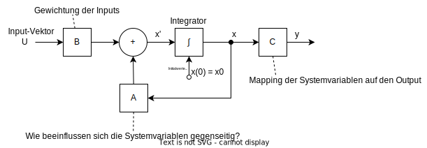

# System-Theorie-Basics

## Aspekte der System-Theorie

Im allgemeinen Fall werden die Inputs nicht von den Interaktionen der Komponenten beeinflusst.

Mathematisch wird ein allgemeines dynamisches System als 6-Tupel formuliert:
$S=(T, A, B, Q, \delta, \lambda)$ (System, Automat)
- $T$ Zeitdomäne (Zeitbereich)
- $A$ Eingangsdomäne (Eingangsbereich)
- $B$ Ausgangsdomäne (Ausgangsbereich)
- $Q$ Zustands-Menge
- $\delta : Q \times A \rightarrow Q$ globale Zustandsübergangsfunktion
- $\lambda : Q \times B \rightarrow Q$ Ausgabefunktion

Die Zustandsübergangsfunktion $\delta$ definiert, wie sich der Systemzustand basierend auf dem aktuellen Zustand und Eingang ändert. Die Ausgabefunktion $\lambda$ bestimmt, welche Ausgabe das System bei gegebenem Zustand und Eingang erzeugt.

## Allgemeines Dynamisches System


- $a$ ist ein konkreter Eingabewert aus der Eingabemenge $A$
- $b$ ist ein konkreter Ausgabewert aus der Ausgabemenge $B$
- $q_0$ Anfangszustand (somit auch ein konkreter Zustand aus der Zustandsmenge $Q$)
- $\delta : Q \times A \rightarrow Q$ globale Zustandsübergangsfunktion
- $\lambda : Q \times B \rightarrow Q$ Ausgabefunktion

## Lineare Differentialsysteme

Lineare Differentialsysteme beschreiben, wie sich der Zustand des Systems über die Zeit verändert und wie der Ausgang von dem aktuellen Zustand abhängt.

---

Wie sich der Zustand des Systems über die Zeit verändert beschreibt die 
**Zustandsgleichung** (State Equation)
```math
x'(t) = Ax(t)+Bu(t)
```
```math
X'=AX+BU
```
Beide Notationen der Gleichung beschreiben dasselbe: Die Änderung des gesamten Zustandsvektors (alle Zustände gleichzeitig) in Abhängigkeit vom aktuellen Zustand und den Eingängen.

---

Wie der Ausgang von dem aktuellen Zustand abhängt beschreibt die
**Ausgangsgleichung** (Output Equation)
```math
y(t) = Cx(t) 
```
```math
Y=CX
```
Auch hier beschreiben beide Notationen dasselbe: Wie sich der gesamte Ausgangsvektor aus dem Zustandsvektor ergibt.
**Definitionen**:
- $X$ ... Zustandsvektor (State vector)
- $x(t)$ Zustandsvektor zum Zeitpunkt t
- $x'(t)$ zeitliche Ableitung des Zustandsvektors
- $A$ ... Systemmatrix
- $B$ ... Eingangsmatrix
- $U$ ... Eingangsvektor (Input signal vector)
- $u(t)$ ... Eingangsvektor zum Zeitpunkt $t$
- $Y$ ... Ausgangsvektor (Output signal vector)
- $y(t)$ ... Ausgangsvektor zum Zeitpunkt t
- $C$ Ausgangsmatrix

### Bedeutung der $A, B, C$-Matrizzen
- **Matrix $A$ (Systemmatrix)**: Beschreibt, wie sich das System aus sich selbst heraus entwickelt bzw. wie die Zustände sich gegenseitig beeinflussen. Jede System-Variable kann von anderen System-Variablen beeinflusst werden.
- **Matrix $B$ (Eingangsmatrix)**: Beschreibt, wie die Eingangssignale auf die Zustandsgrößen einwirken bzw. wie stark die Eingänge die verschiedenen Zustände beeinflussen. Jede Systemvariable kann von den Eingängen beeinflusst werden.
- **Matrix C (Ausgangsmatrix)**: Beschreibt, wie sich die internen Zustände auf die Ausgangssignale abbilden bzw. wie die Zustände die Ausgänge beeinflussen. Jeder Zustand kann sich auf die Ausgänge auswirken.

$A$, $B$ und $C$ sind Matrizen, die aus reellen Zahlen bestehen.

Die Dimensionen sind folgendermaßen bestimmt (Höhe $\times$ Breite):
- $A$ ist eine $n \times n$ Matrix ($n$ = Anzahl der Zustände)
- $B$ ist eine $n \times m$ Matrix ($m$ = Anzahl der Eingänge)
- $C$ ist eine $p \times n$ Matrix ($p$ = Anzahl der Ausgänge)

Die Komponenten dieser Matrizen sind konstant für ein lineares, zeitinvariantes System - sie ändern sich also nicht mit der Zeit.

### Ein einfaches Beispiel

- 3 Zustände ($n=3$)
- 2 Eingänge ($m=1$)
- 1 Ausgang ($p=1$)

```
A = [1  2  0]    B = [1  0]    C = [1  0  2]
    [0  1  3]        [0  1]
    [2  1  1]        [1  1]
```
**Interpretation:**

Die Matrix $A$ (3×3) beschreibt die interne Dynamik des Systems:
- Erste Zeile: Wie $x_1'$ von $x_1$, $x_2$, $x_3$ abhängt
- Zweite Zeile: Wie $x_2'$ von $x_1$, $x_2$, $x_3$ abhängt
- Dritte Zeile: Wie $x_3'$ von $x_1$, $x_2$, $x_3$ abhängt

Die Matrix $B$ (3×2) beschreibt wie die zwei Eingänge auf die drei Zustände wirken:
- Erste Zeile: $u_1$ beeinflusst $x_1$ mit $1$, $u_2$ mit $0$
- Zweite Zeile: $u_1$ beeinflusst $x_2$ mit $0$, $u_2$ mit $1$
- Dritte Zeile: beide Eingänge beeinflussen $x_3$ mit $1$

Die Matrix C (1×3) beschreibt wie der eine Ausgang von den drei Zuständen abhängt:
- $y = 1 \cdot x_1 + 0 \cdot x_2 + 2 \cdot x_3$
Der Zustand $x_2$ hat also keine direkte Auswirkung auf den Ausgang, jedoch wird indirekt über die Beeinflussung anderer Systemzustände auch Einfluss auf den Ausgang genommen. 

### Allgemeine Darstellung als Blockschaltbild



### Konkretes Beispiel als Blockschaltbild

```
A = [1  2  0]    B = [1  0]    C = [1  0  2]
    [0  1  3]        [0  1]
    [2  1  1]        [1  1]
```


> Zum besseren Verständnis habe ich hier noch eine eingefärbte Variante angefertigt.


